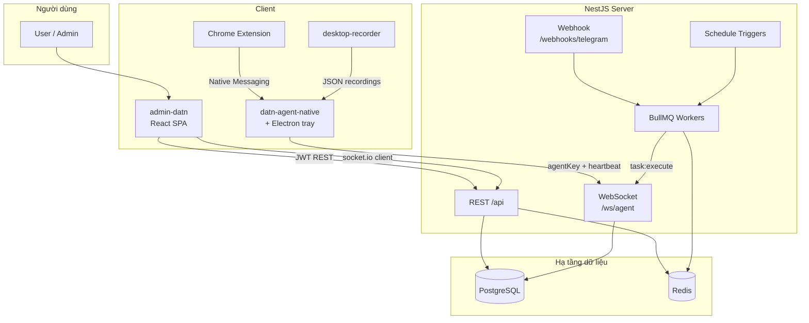
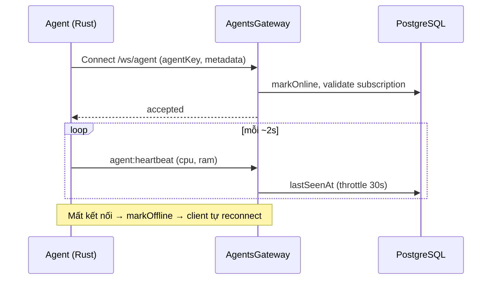
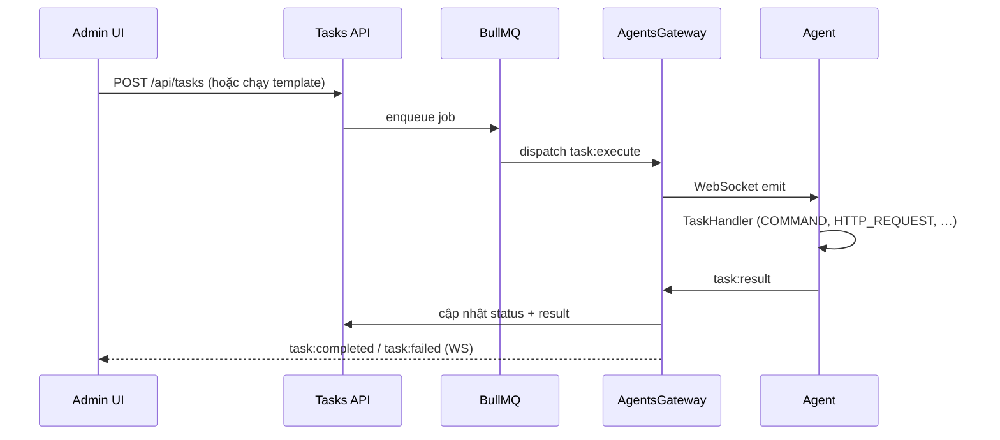
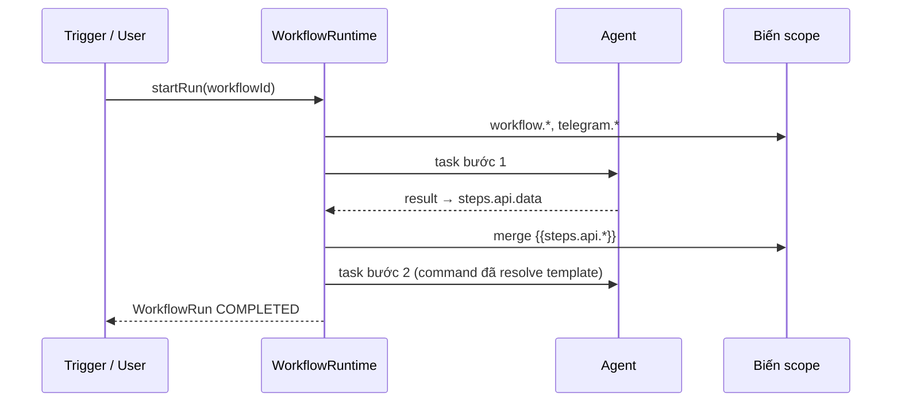
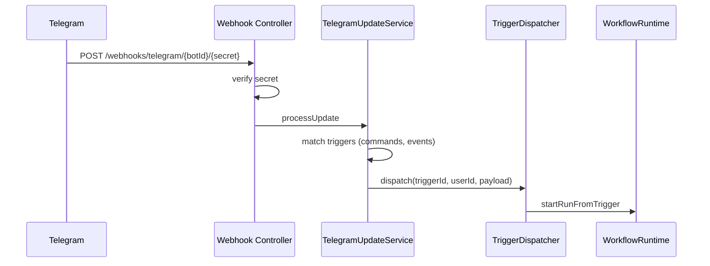
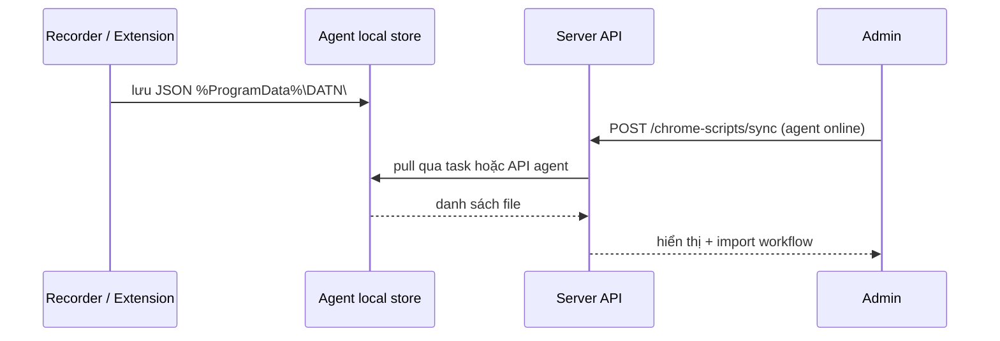

# DATN — Nền tảng Agent, Task & Workflow Automation

Monorepo triển khai hệ thống **điều phối agent máy trạm**, **hàng đợi task**, **workflow đồ thị**, **trigger lịch/Telegram** và **console quản trị web**. Agent chạy trên Windows (Rust native + Electron tray), server điều phối qua HTTP REST và WebSocket.

---

## Mục lục

1. [Tổng quan](#tổng-quan)
2. [Công nghệ](#công-nghệ)
3. [Cấu trúc thư mục](#cấu-trúc-thư-mục)
4. [Cài đặt & chạy dev](#cài-đặt--chạy-dev)
5. [Triển khai production](#triển-khai-production)
6. [Luồng hoạt động](#luồng-hoạt-động)
7. [API & WebSocket](#api--websocket)
8. [Tài liệu chi tiết](#tài-liệu-chi-tiết)

---

## Tổng quan

| Thành phần | Vai trò |
|------------|---------|
| **Server** (`src/`) | NestJS API, BullMQ worker, Socket.IO gateway, trigger Telegram/lịch, billing |
| **Admin UI** (`admin-datn/`) | React SPA — dashboard, agent fleet, task template, workflow editor, bot Telegram |
| **Agent** (`agent/`) | `datn-agent-native` (Rust) kết nối WS, thực thi task; Electron tray cấu hình & service Windows |
| **Chrome Extension** | Ghi/chạy lại thao tác DOM qua Native Messaging |
| **Desktop Recorder** | Ghi chuột/phím/UIA, xuất JSON `DESKTOP_AUTOMATION` |

**Luồng nghiệp vụ chính:** User tạo workflow / task template trên admin → server enqueue qua Redis → gửi `task:execute` tới agent online → agent trả `task:result` → cập nhật DB + push realtime tới UI.

---

## Công nghệ

### Backend (server)

| Lớp | Công nghệ |
|-----|-----------|
| Runtime | Node.js 20+, TypeScript 5 |
| Framework | NestJS 11 |
| ORM | Prisma 6 + PostgreSQL 16 |
| Queue | BullMQ + Redis 7 |
| Realtime | Socket.IO (`@nestjs/platform-socket.io`) |
| Auth | JWT access/refresh, Passport, RBAC (`ADMIN` / `USER`) |
| Billing | SePay VietQR + webhook |
| Lịch | `@nestjs/schedule` + cron triggers |
| API docs | Swagger (`/api/docs`) |
| Log | Pino (`nestjs-pino`) |

### Frontend (admin-datn)

| Lớp | Công nghệ |
|-----|-----------|
| UI | React 19, Vite 6, Tailwind CSS 4 |
| Routing | React Router 7 |
| Data | TanStack Query 5 |
| Workflow canvas | React Flow (`@xyflow/react`) |
| Realtime | `socket.io-client` |
| i18n | Type-safe keys (`src/i18n/vi.ts`) |

### Agent (máy trạm)

| Lớp | Công nghệ |
|-----|-----------|
| Core runtime | Rust (`agent/core`) — WebSocket, task registry, Win32 |
| Desktop shell | Electron (`agent/desktop`) — tray, cài đặt, installer NSIS |
| UIA | `datn-windows-uia` crate |
| Recorder | `datn-desktop-recorder` (egui) |
| Chrome bridge | `datn-chrome-bridge` + MV3 extension |

### Task types hỗ trợ trên agent

`COMMAND` · `SCRIPT` · `SYSTEM_INFO` · `OPEN_APP` · `OPEN_BROWSER` · `DESKTOP_AUTOMATION` · `CHROME_EXTENSION` · `SCREEN_CAPTURE` · `HTTP_REQUEST` · (`FILE_OPERATION` — chưa implement)

---

## Cấu trúc thư mục

```
server_datn/
├── src/                          # NestJS backend
│   ├── main.ts                   # Bootstrap, Swagger, global prefix /api
│   ├── app.module.ts             # Root module
│   ├── config/                   # Typed env configuration
│   ├── prisma/                   # PrismaService (global)
│   ├── common/                   # Guards, filters, WS protocol, decorators
│   └── modules/
│       ├── auth/                 # Đăng ký, login, refresh token
│       ├── users/                # Profile, admin quản lý user
│       ├── agents/               # CRUD agent + AgentsGateway (/ws/agent)
│       ├── tasks/                # Task, template, BullMQ processor
│       ├── automation/           # Workflow, runtime graph, biến {{steps.*}}
│       ├── triggers/             # Schedule + Telegram bot/webhook
│       ├── billing/              # Gói đăng ký, SePay
│       ├── chrome-scripts/       # Script Chrome sync từ agent
│       ├── desktop-recordings/   # Bản ghi desktop sync từ agent
│       ├── admin/                # API admin + audit
│       └── health/               # Health check
│
├── admin-datn/                   # React admin SPA
│   ├── src/
│   │   ├── views/                # Trang: Dashboard, Agents, Tasks, Workflows…
│   │   ├── components/           # UI, workflow editor, forms task
│   │   ├── api/                  # HTTP client modules
│   │   ├── context/              # Auth, WebSocket provider
│   │   └── lib/                  # Workflow graph, mappers, i18n
│   └── .env.example              # VITE_API_BASE_URL, VITE_WS_URL
│
├── agent/                        # Máy trạm Windows
│   ├── core/                     # datn-agent-native (Rust)
│   ├── desktop/                  # Electron tray + installer
│   ├── desktop-recorder/         # GUI/CLI ghi desktop
│   ├── chrome-bridge/            # Native messaging host
│   ├── chrome-extension/         # Extension Chrome
│   ├── datn-windows-uia/         # UI Automation helpers
│   ├── bin/                      # Binary sau build (gitignore)
│   └── docs/                     # Luồng agent, mở rộng task
│
├── prisma/
│   ├── schema.prisma             # Schema đầy đủ
│   ├── seed.ts                   # User demo, gói trial/tháng
│   └── migrations/
│       └── 20260401000000_baseline/   # Migration gộp (baseline)
│
├── docs/                         # Kiến trúc & flows chi tiết (Mermaid)
├── docker-compose.yml            # PostgreSQL, Redis, app
├── Dockerfile                    # Multi-stage build NestJS
└── .env.example                  # Biến môi trường server
```

---

## Cài đặt & chạy dev

### Yêu cầu

- **Node.js** ≥ 20, npm
- **Docker** & Docker Compose (PostgreSQL + Redis local)
- **Rust toolchain** (chỉ khi build agent)
- Windows 10/11 x64 (chạy agent đầy đủ tính năng)

### 1. Clone & cài dependency server

```bash
git clone <repo-url> server_datn
cd server_datn
npm install
```

### 2. Cấu hình môi trường

```bash
cp .env.example .env
# Chỉnh DATABASE_URL, REDIS_*, JWT_*, CORS_ORIGINS
```

| File | Phạm vi |
|------|---------|
| `.env` (root) | Backend, DB, Redis, JWT, SePay, `PUBLIC_API_BASE_URL` |
| `admin-datn/.env` | `VITE_API_BASE_URL`, `VITE_WS_URL` |
| `agent/.env` | Dev agent (`SERVER_WS_URL`, `AGENT_KEY`) |
| `%ProgramData%\DATN\agent.env` | Agent production (Windows) |

### 3. Khởi động PostgreSQL + Redis

```bash
docker compose up -d postgres redis
```

### 4. Database

```bash
# DB mới (trống)
npx prisma migrate deploy
npx prisma db seed

# Dev (tạo migration mới khi đổi schema)
npx prisma migrate dev
```

> **Lưu ý:** Repo dùng **một migration baseline** `20260401000000_baseline`. DB đã chạy migration cũ trước đó cần baseline lại — xem [Triển khai production](#triển-khai-production).

### 5. Chạy backend

```bash
npm run start:dev
# API:     http://localhost:3000/api
# Swagger: http://localhost:3000/api/docs
# Health:  http://localhost:3000/api/health
```

### 6. Chạy admin UI

```bash
cd admin-datn
cp .env.example .env
npm install
npm run dev
# http://localhost:5173
```

### 7. Build & chạy agent (Windows)

```powershell
cd agent
npm install
npm run build:core          # → agent/bin/datn-agent-native.exe
npm run dev                 # Electron tray + spawn core
```

Tạo agent trên admin → copy **Agent Key** → nhập trong tray **Cài đặt** hoặc `agent.env`.

### Tài khoản seed

| Email | Mật khẩu | Role |
|-------|----------|------|
| admin@datn.com | admin123 | ADMIN |
| user@datn.com | user123 | USER |

---

## Triển khai production

### Docker (server)

```bash
# Build & chạy full stack (postgres + redis + app)
docker compose up -d --build
```

`Dockerfile` multi-stage: `npm ci` → `prisma generate` → `nest build` → image production chạy `node dist/main.js`.

### Admin SPA

```bash
cd admin-datn
npm run build
# Phục vụ thư mục dist/ qua nginx / CDN
# VITE_API_BASE_URL trỏ tới domain API production
```

### Agent Windows

```powershell
cd agent
npm run dist:desktop   # NSIS installer trong desktop/release/
npm run service:install   # Windows Service DATNAgentNative (cần Admin)
```

Config production: `%ProgramData%\DATN\agent.env`

### Telegram webhook

Telegram yêu cầu **HTTPS public**. Đặt trong `.env`:

```env
PUBLIC_API_BASE_URL=https://<domain-hoặc-ngrok>/api
```

Đăng ký bot tại admin **Bot** → server gọi `setWebhook` tới `/api/webhooks/telegram/{botId}/{secret}`.

### Migration baseline (DB đã tồn tại)

Nếu DB đã apply migration cũ trước khi gộp baseline:

```sql
DELETE FROM "_prisma_migrations";
```

```bash
npx prisma migrate resolve --applied 20260401000000_baseline
npx prisma migrate status   # phải: up to date
```

### Biến môi trường quan trọng

| Biến | Mô tả |
|------|--------|
| `DATABASE_URL` | PostgreSQL connection string |
| `REDIS_*` / `REDIS_URL` | BullMQ + cache |
| `JWT_ACCESS_SECRET` / `JWT_REFRESH_SECRET` | Bắt buộc đổi trên production |
| `CORS_ORIGINS` | Origin admin SPA |
| `PUBLIC_API_BASE_URL` | Base HTTPS cho Telegram webhook |
| `SEPAY_*` | Thanh toán VietQR |
| `TASK_WORKER_CONCURRENCY` | Số job BullMQ song song |

---

## Luồng hoạt động

### Kiến trúc tổng quan



### Kết nối Agent & heartbeat



### Thực thi Task đơn



### Workflow đồ thị

```mermaid
flowchart LR
  T[Trigger<br/>Manual / Schedule / Telegram]
  W[Workflow Graph<br/>nodes + edges]
  R[WorkflowRuntime]
  S1[Bước 1<br/>outputKey → scope]
  S2[Bước 2<br/>{{steps.key.*}}]
  SN[Bước N]

  T --> R
  W --> R
  R --> S1
  S1 -->|publishStepOutput| S2
  S2 --> SN
```



### Trigger Telegram



### Đồng bộ Chrome script / Desktop recording



---

## API & WebSocket

### REST (prefix `/api`)

| Module | Đường dẫn | Mô tả |
|--------|-----------|--------|
| Auth | `/auth` | register, login, refresh, logout |
| Users | `/users` | profile, admin CRUD |
| Agents | `/agents` | fleet, regenerate key |
| Tasks | `/tasks` | task + template, cancel, retry |
| Workflows | `/workflows` | CRUD, execute, graph |
| Triggers | `/triggers` | schedule, telegram; `/triggers/telegram/bots` |
| Billing | `/billing` | gói, checkout SePay |
| Chrome scripts | `/chrome-scripts` | sync, CRUD |
| Desktop recordings | `/desktop-recordings` | sync, CRUD |
| Admin | `/admin` | users, plans, audit |
| Health | `/health` | liveness |

### WebSocket

| Namespace | Client | Auth |
|-----------|--------|------|
| `/ws/agent` | `datn-agent-native` | `agentKey` trong handshake |
| Client events (UI) | admin SPA | JWT qua socket auth |

| Event | Hướng | Mô tả |
|-------|--------|--------|
| `agent:heartbeat` | Agent → Server | Telemetry ~2s |
| `task:execute` | Server → Agent | Payload task |
| `task:result` | Agent → Server | Kết quả thực thi |
| `task:running` / `task:completed` / `task:failed` | Server → UI | Cập nhật realtime |

Chi tiết payload: `src/common/types/ws-protocol.ts`, `src/common/constants/index.ts`.

### Biến workflow

| Prefix | Ví dụ | Nguồn |
|--------|-------|--------|
| `workflow.` | `{{workflow.API_URL}}` | Biến workflow / trigger payload |
| `steps.` | `{{steps.api.data}}` | Output bước (theo `outputKey`) |
| `prev.` | `{{prev.stdout}}` | Bước hoàn thành gần nhất |
| `telegram.` | `{{telegram.chatId}}` | Trigger Telegram |

---

## Tài liệu chi tiết

| Tài liệu | Nội dung |
|----------|----------|
| [docs/README.md](./docs/README.md) | Hub tài liệu + sơ đồ tóm tắt |
| [docs/project-memory/architecture.md](./docs/project-memory/architecture.md) | Kiến trúc container, module, ER |
| [docs/project-memory/flows.md](./docs/project-memory/flows.md) | Sequence diagram đầy đủ |
| [agent/README.md](./agent/README.md) | Build agent, Chrome, desktop recorder |
| [agent/docs/flows.md](./agent/docs/flows.md) | Luồng WS & task trên Rust |
| [admin-datn/README.md](./admin-datn/README.md) | Frontend admin |

### Scripts hữu ích

```bash
# Backend
npm run start:dev
npm run build && npm run start:prod
npm run prisma:studio

# Docker
npm run docker:up
npm run docker:down

# Agent (trong thư mục agent/)
npm run build:core
npm run build:all
npm run clean
```

### Ghi chú vận hành

- Agent cần **subscription active** mới giữ kết nối WS (heartbeat kiểm tra gói).
- `HTTP_REQUEST` chạy trên agent — gọi API nội bộ/VPN/localhost của máy agent.
- Build artifacts (`agent/**/target/`, `agent/bin/`) đã gitignore — rebuild sau khi clone.
- Log server: `LOG_LEVEL` trong `.env`; agent: `%ProgramData%\DATN\agent.env` hoặc `RUST_LOG`.

---

**License:** UNLICENSED (private).
