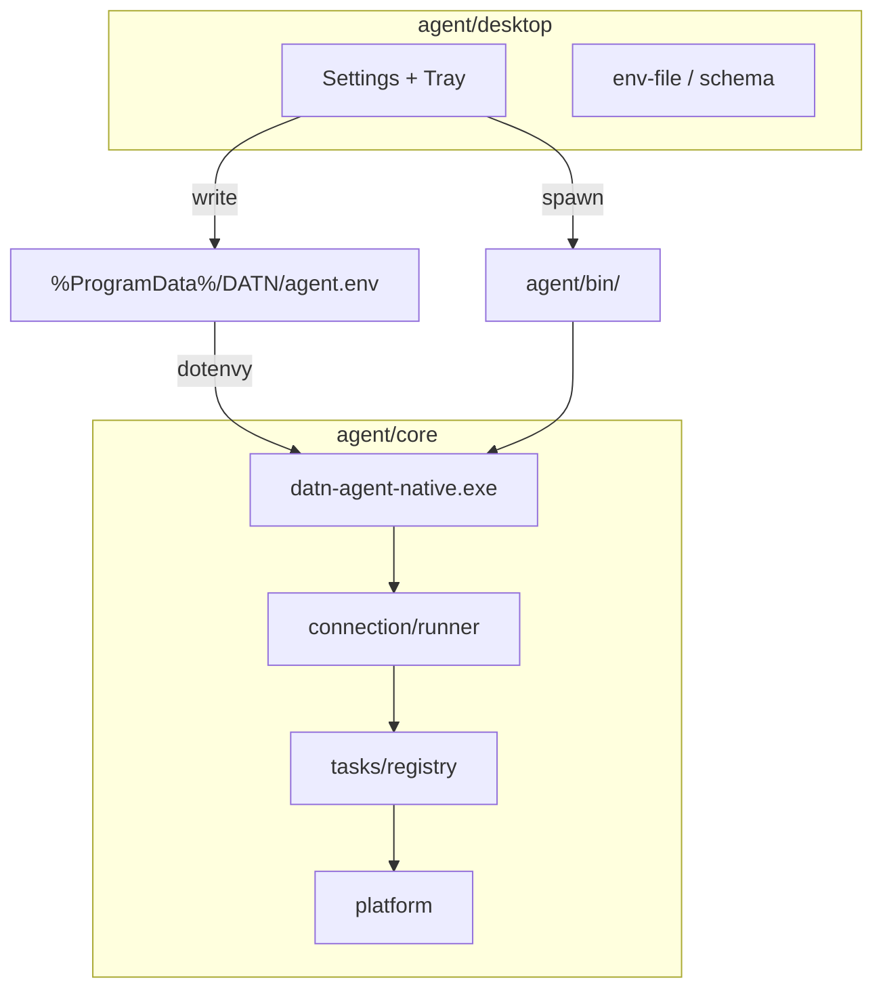

# Kiến trúc Agent

## Vai trò

| Thành phần | Vị trí | Việc |
|------------|--------|------|
| **Rust core** | [`core/`](../core/) | Socket.IO `/ws/agent`, heartbeat, task registry, platform OS |
| **Desktop app** | [`desktop/`](../desktop/) | Electron: sửa config, tray, log, cài Windows Service |
| **Config** | `%ProgramData%\DATN\agent.env` | Single source of truth (dev: `agent/.env`) |

## Entrypoint

| Entry | Mô tả |
|-------|--------|
| `bin/datn-agent-native.exe` / `agent` | Foreground agent |
| `datn-agent-native.exe service` | Windows Service |
| `desktop` → `npm run dev` | Control panel + spawn core |
| `desktop/dist/main/index.js` | Electron main (packaged) |

## Thư mục mã (Rust core)

| Vị trí | Vai trò |
|--------|---------|
| `core/src/connection/` | Socket.IO runner, telemetry heartbeat |
| `core/src/config/` | `AgentConfig`, nạp `agent.env` |
| `core/src/protocol/` | `TaskWire` — format `task:result` |
| `core/src/tasks/` | Registry `TaskHandler`, `run_task`, `supported_task_types` |
| `core/src/tasks/handlers/` | Handler từng task type (`command`, `open_app`, `desktop`, …) |
| `core/src/platform/` | Trait OS: shell, open_app, desktop |
| `core/src/platform/windows/` | Service, named pipe, Win32 desktop |
| `desktop/src/shared/` | paths, env-schema, env-file |
| `desktop/src/main/` | Electron entry, IPC, settings window |
| `desktop/src/tray/` | Tray + spawn core |
| `desktop/src/service/` | sc.exe install/uninstall |

## Giới hạn song song task

`TASK_MAX_CONCURRENCY` — semaphore trong `core/src/connection/runner.rs`.

## Metadata connect

Auth payload gồm `metadata.capabilities`: danh sách task type agent hỗ trợ trên host hiện tại (ví dụ bỏ `DESKTOP_AUTOMATION` khi không phải Windows).
