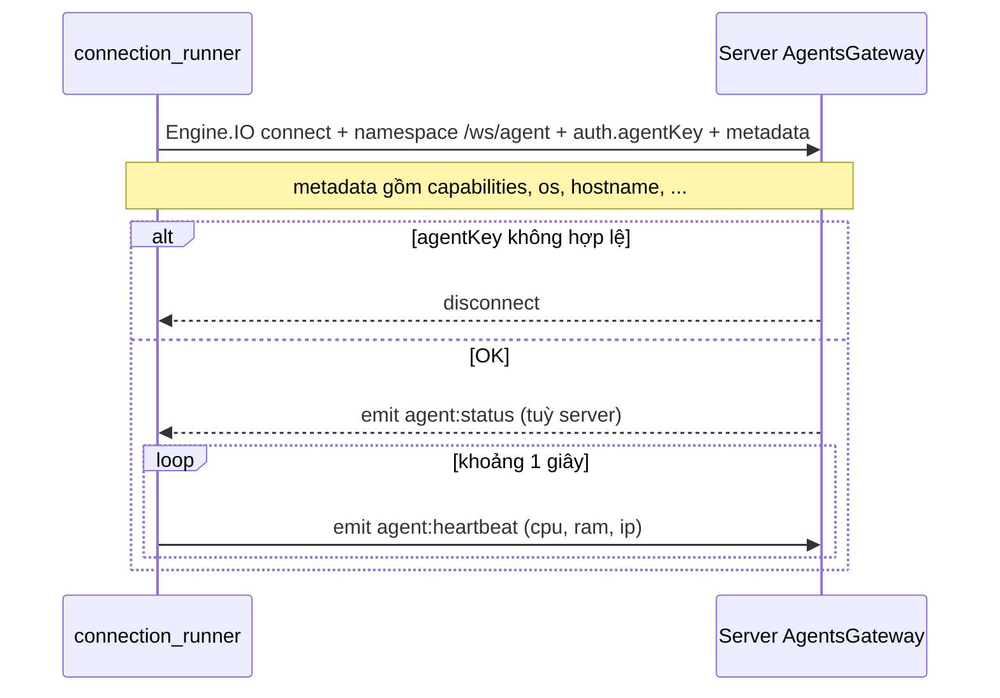
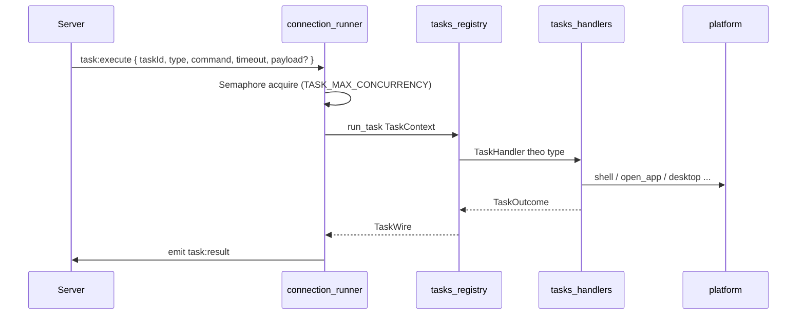
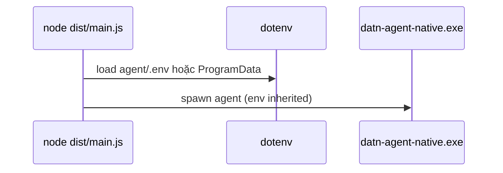

# Luồng hoạt động Agent

Tên sự kiện và payload: [`src/common/constants/index.ts`](../../src/common/constants/index.ts), [`src/common/types/ws-protocol.ts`](../../src/common/types/ws-protocol.ts).

---

## 1. Kết nối `/ws/agent` và heartbeat

Sau `connect`, Rust đăng ký callback **`task:execute`** trong [`core/src/connection/runner.rs`](../core/src/connection/runner.rs).

---

## 2. Thực thi task

- Parse: `TaskExecute::from_json` trong [`tasks/registry.rs`](../core/src/tasks/registry.rs).
- Dispatch: tìm handler trong `HANDLERS` (không còn `match` monolithic trong một file).
- Serialize: [`protocol/wire.rs`](../core/src/protocol/wire.rs) → `tool_result_to_task_wire`.

---

## 3. Launcher Node / Electron

`tray.ts`: import `config.ts` (đã nạp `.env`) trước khi spawn — cùng ý.

---

## 4. Windows Service

`sc create DATNAgentNative binPath= "...\datn-agent-native.exe" service`

Service process = [`platform/windows/service.rs`](../core/src/platform/windows/service.rs) `run()` → [`connection/runner.rs`](../core/src/connection/runner.rs) `run_with_stop` cho đến khi SCM gửi **Stop**.

Subcommand `worker`: named pipe user + desktop — [`platform/windows/pipe_server.rs`](../core/src/platform/windows/pipe_server.rs).

---

## 5. Orchestration đa bước

Agent **không** còn pipeline flow nội bộ kiểu registry + `FlowRunner`. Nhiều bước = **nhiều task** từ server/workflow, hoặc một task `DESKTOP_AUTOMATION` với mảng `steps`.
