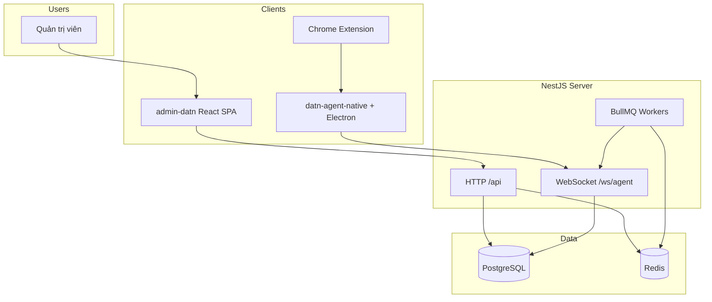
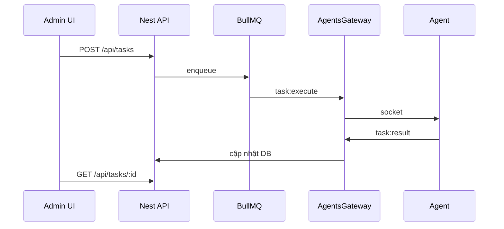

# Tài liệu dự án DATN (server_datn)

Tài liệu kỹ thuật cho monorepo **quản lý Agent · Task · Workflow · Tự động hóa**.

## Mục lục

| Tài liệu | Mô tả |
|----------|--------|
| [project-memory/README.md](./project-memory/README.md) | Chỉ mục chi tiết (đọc theo thứ tự gợi ý) |
| [project-memory/architecture.md](./project-memory/architecture.md) | **Kiến trúc hệ thống** — sơ đồ ngữ cảnh, container, triển khai, module |
| [project-memory/flows.md](./project-memory/flows.md) | **Luồng hoạt động** — sequence & flowchart (auth, agent, task, workflow, sync) |
| [project-memory/agent.md](./project-memory/agent.md) | Agent Rust / Electron / Chrome |
| [project-memory/code-reference.md](./project-memory/code-reference.md) | Bản đồ file theo package |
| [Bao-cao-tien-do-21-04-30-05-2026.docx](./Bao-cao-tien-do-21-04-30-05-2026.docx) | Báo cáo tiến độ 21/04–30/05/2026 |

## Sơ đồ nhanh (xem trước)

### Kiến trúc tổng quan

### Luồng task (tóm tắt)

> Sơ đồ đầy đủ: [flows.md](./project-memory/flows.md).

## Xem sơ đồ Mermaid

- **GitHub / GitLab**: render trực tiếp trong file `.md`.
- **VS Code / Cursor**: extension *Markdown Preview Mermaid Support*.
- **Trang Docs trong admin**: route `/docs` (nội dung `admin-datn`).

## Cấu hình môi trường

| File | Phạm vi |
|------|---------|
| `.env.example` (root) | Backend, DB, Redis, JWT |
| `admin-datn/.env` | `VITE_API_URL`, … |
| `agent/.env.example` | Dev agent |
| `%ProgramData%\DATN\agent.env` | Agent production (Windows) |

## Khởi động nhanh

Xem [README.md](../README.md) (root repo) và [architecture.md](./project-memory/architecture.md#khởi-động-nhanh-dev).

## Độ khớp với code

Tài liệu `project-memory/` được **đối chiếu với** `src/app.module.ts`, `prisma/schema.prisma`, controllers và `WS_EVENTS` (cập nhật lần cuối khi rà soát repo).

| Đúng | Lưu ý |
|------|--------|
| Module Nest trong `app.module.ts` | Không có module `task-templates` riêng — template nằm trong **tasks** |
| API sync script/recording | `POST /api/chrome-scripts/sync`, `POST /api/desktop-recordings/sync` |
| Workflow steps | `StepType`: COMMAND, SCRIPT, DELAY, CONDITION, TELEGRAM |
| Triggers HTTP | `/api/triggers` (không gộp vào `/api/workflows`) |
| Desktop “bắt control” | DATN: tọa độ (`desktop-recorder`); PAD tham chiếu: **UIA + MSAA + OCR/ảnh** — xem [architecture §9](./project-memory/architecture.md#9-bắt-windows--control--power-automate-desktop-pad-vs-datn) |

Nếu đổi route/event trong code, cập nhật `flows.md` + `architecture.md` cùng lúc.
