# Danh mục biểu đồ báo cáo đồ án

**Đề tài:** Hệ thống quản lý và thực thi tác vụ tự động trên máy trạm Windows qua mô hình agent–server

## Cách xuất hình cho Word

1. Mở [https://mermaid.live](https://mermaid.live) hoặc VS Code + extension *Mermaid*.
2. Copy từng khối code `mermaid` bên dưới (không copy dòng `%%`).
3. Export **PNG** hoặc **SVG** → chèn vào Word, đặt chú thích *Hình X.Y*.
4. Các mục **Screenshot** — chụp màn hình production/local, không vẽ Mermaid.

| Hình | Chương | Loại | Nguồn trong file |
|------|--------|------|------------------|
| 1.1 | 1 | Mermaid | § Hình 1.1 |
| 1.2 | 1 | Mermaid | § Hình 1.2 |
| 2.1 | 2 | PlantUML | § Hình 2.1 |
| 2.2 | 2 | PlantUML | § Hình 2.2 — Phân rã *Đăng nhập / đăng ký* |
| 2.3 | 2 | PlantUML | § Hình 2.3 — Phân rã *Quản lý fleet agent* |
| 2.4 | 2 | PlantUML | § Hình 2.4 — Phân rã *Quản lý task và template* |
| 2.5 | 2 | PlantUML | § Hình 2.5 — Phân rã *Thiết kế workflow* |
| 2.6 | 2 | PlantUML | § Hình 2.6 — Phân rã *Chạy task / workflow* |
| 2.7 | 2 | PlantUML | § Hình 2.7 — Phân rã *Cấu hình trigger* |
| 2.8 | 2 | PlantUML | § Hình 2.8 — Phân rã *Xem dashboard* |
| 2.9 | 2 | PlantUML | § Hình 2.9 — Phân rã *Quản lý người dùng* |
| 2.10 | 2 | PlantUML | § Hình 2.10 — Phân rã *Xem nhật ký audit* |
| 2.11 | 2 | Mermaid | § Hình 2.11 — Quy trình nghiệp vụ |
| 4.1 | 4 | PlantUML | § Hình 4.1 — Biểu đồ gói UML (mục 4.1.2) |
| 4.2 | 4 | PlantUML | § Hình 4.2 — Chi tiết gói server.quan-tri |
| 4.3 | 4 | PlantUML | § Hình 4.3 — Chi tiết gói server.dieu-phoi |
| 4.4 | 4 | PlantUML | § Hình 4.4 — Chi tiết gói agent.core |
| 4.5 | 4 | **Wireframe** | Dashboard (thiết kế 4.2.1) |
| 4.6 | 4 | **Wireframe** | Workflow editor |
| 4.7 | 4 | **Wireframe** | Trang Agents |
| 4.8 | 4 | Mermaid | § Hình 4.8 — Sequence dispatch task (UC004) |
| 4.8b | 4 | Mermaid | § Hình 4.8b — Sequence chạy workflow (UC005) |
| 4.8c | 4 | Mermaid | § Hình 4.8c — Sequence trigger Telegram |
| 4.9 | 4 | Mermaid | § Hình 4.9 — E-R nghiệp vụ cốt lõi |
| 4.9b | 4 | Mermaid | § Hình 4.9b — Lược đồ logic nhóm bảng |
| 4.9c | 4 | Mermaid | § Hình 4.9c — E-R mở rộng |
| 4.14 | 4 | **Screenshot** | Schema Prisma / ORM |
| 4.15 | 4 | **Screenshot** | Prisma Studio hoặc pgAdmin |
| 4.10 | 4 | **Screenshot** | Tạo task + kết quả |
| 4.11 | 4 | **Screenshot** | Workflow RUNNING |
| 4.12 | 4 | Mermaid | § Hình 4.12 — Triển khai production |
| 4.13 | 4 | **Screenshot** | Railway deploy / health (tùy chọn) |
| B.1 | Phụ lục | Mermaid | § Trạng thái task |
| B.2 | Phụ lục | Mermaid | § Agent online |
| B.3 | Phụ lục | Mermaid | § Chạy workflow |
| B.4 | Phụ lục | Mermaid | § Trigger Telegram |

---

## Chương 1 — Giới thiệu đề tài

### Hình 1.1 — Kiến trúc agent–server ba tầng (Định hướng giải pháp)

*Chú thích gợi ý:* Kiến trúc ba tầng: Presentation (console web), Application (NestJS, WebSocket, BullMQ, workflow), Execution (fleet agent Windows); PostgreSQL và Redis là lớp lưu trữ.

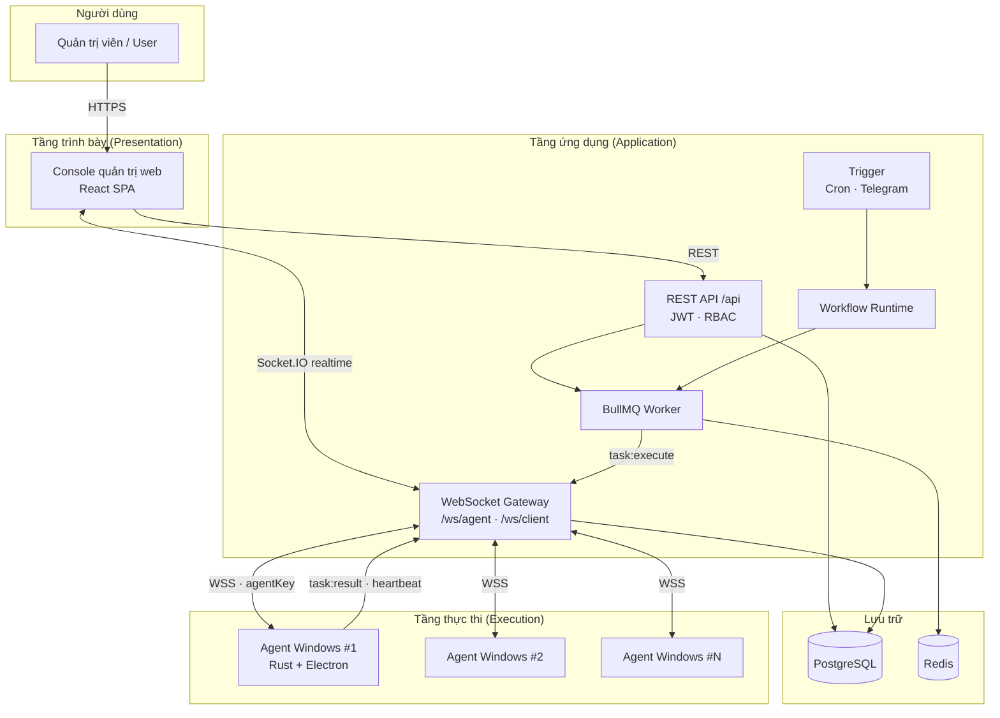

---

### Hình 1.2 — Luồng nghiệp vụ chính

*Chú thích gợi ý:* Luồng tạo task/workflow → enqueue Redis → dispatch WebSocket → agent thực thi → cập nhật CSDL → push realtime tới console.

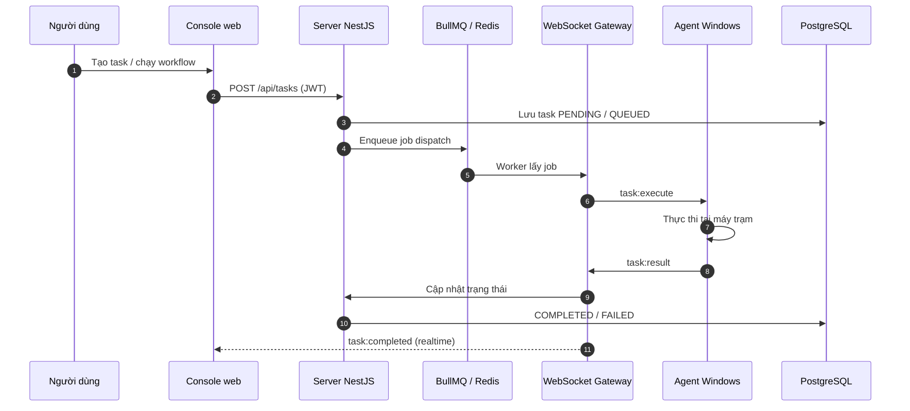

---

## Chương 2 — Khảo sát và phân tích yêu cầu

### Hình 2.1 — Biểu đồ use case tổng quan

*Chú thích gợi ý:* Hai tác nhân USER và ADMIN; các use case quản lý agent, task, workflow, trigger và quản trị hệ thống.

**→ Dùng PlantUML (UML chuẩn — oval, actor, khung hệ thống):** [`docs/diagrams/hinh-2-1-use-case-tong-quan.puml`](diagrams/hinh-2-1-use-case-tong-quan.puml)  
Export: [plantuml.com/plantuml](https://www.plantuml.com/plantuml/uml/) — hướng dẫn: [`docs/diagrams/README-use-case.md`](diagrams/README-use-case.md)

Mermaid (phác thảo — không đúng chuẩn UML oval)

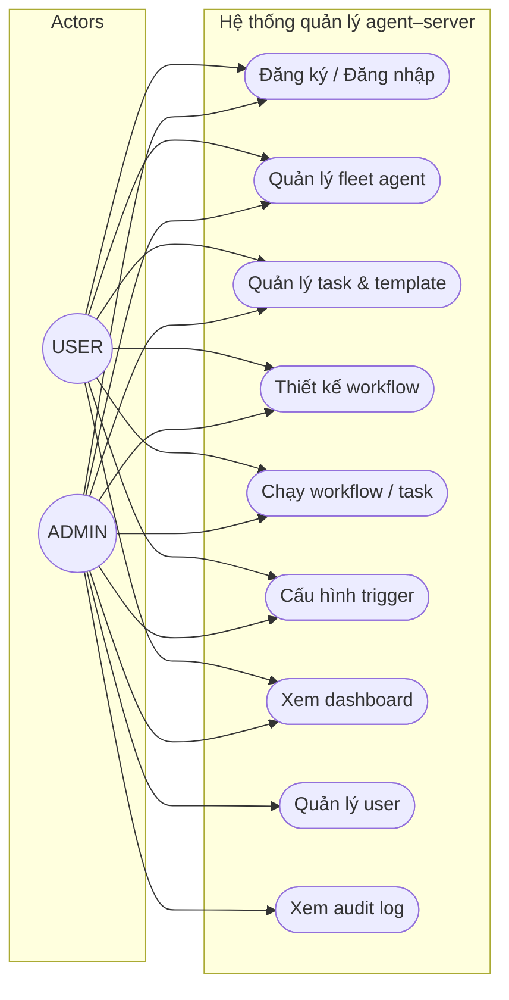

---

### Hình 2.2 — Phân rã use case *Đăng nhập / đăng ký*

*Mục báo cáo:* §2.2.2

**→ PlantUML:** [`docs/diagrams/hinh-2-2-dang-nhap-dang-ky.puml`](diagrams/hinh-2-2-dang-nhap-dang-ky.puml)

---

### Hình 2.3 — Phân rã use case *Quản lý fleet agent*

*Mục báo cáo:* §2.2.3

**→ PlantUML:** [`docs/diagrams/hinh-2-3-quan-ly-fleet-agent.puml`](diagrams/hinh-2-3-quan-ly-fleet-agent.puml)

---

### Hình 2.4 — Phân rã use case *Quản lý task và template*

*Mục báo cáo:* §2.2.4

**→ PlantUML:** [`docs/diagrams/hinh-2-4-quan-ly-task-template.puml`](diagrams/hinh-2-4-quan-ly-task-template.puml)

---

### Hình 2.5 — Phân rã use case *Thiết kế workflow*

*Mục báo cáo:* §2.2.5

**→ PlantUML:** [`docs/diagrams/hinh-2-5-thiet-ke-workflow.puml`](diagrams/hinh-2-5-thiet-ke-workflow.puml)

---

### Hình 2.6 — Phân rã use case *Chạy task / workflow*

*Mục báo cáo:* §2.2.6

**→ PlantUML:** [`docs/diagrams/hinh-2-6-chay-task-workflow.puml`](diagrams/hinh-2-6-chay-task-workflow.puml)

---

### Hình 2.7 — Phân rã use case *Cấu hình trigger (Cron · Telegram)*

*Mục báo cáo:* §2.2.7

**→ PlantUML:** [`docs/diagrams/hinh-2-7-cau-hinh-trigger.puml`](diagrams/hinh-2-7-cau-hinh-trigger.puml)

---

### Hình 2.8 — Phân rã use case *Xem dashboard*

*Mục báo cáo:* §2.2.8

**→ PlantUML:** [`docs/diagrams/hinh-2-8-xem-dashboard.puml`](diagrams/hinh-2-8-xem-dashboard.puml)

---

### Hình 2.9 — Phân rã use case *Quản lý người dùng*

*Mục báo cáo:* §2.2.9

**→ PlantUML:** [`docs/diagrams/hinh-2-9-quan-ly-nguoi-dung.puml`](diagrams/hinh-2-9-quan-ly-nguoi-dung.puml)

---

### Hình 2.10 — Phân rã use case *Xem nhật ký audit*

*Mục báo cáo:* §2.2.10

**→ PlantUML:** [`docs/diagrams/hinh-2-10-xem-nhat-ky-audit.puml`](diagrams/hinh-2-10-xem-nhat-ky-audit.puml)

---

### Hình 2.11 — Biểu đồ hoạt động quy trình nghiệp vụ

*Mục báo cáo:* §2.2.11 — Quy trình nghiệp vụ kết hợp nhiều use case: đưa agent vào fleet → chuẩn bị task/workflow → kích hoạt (thủ công hoặc trigger) → thực thi trên máy trạm → giám sát kết quả.

*Lưu ý:* Các bước ở mức **nghiệp vụ** (tên use case mức cao), không mô tả chi tiết pipeline kỹ thuật như BullMQ/WebSocket (đã có ở §2.2.6).

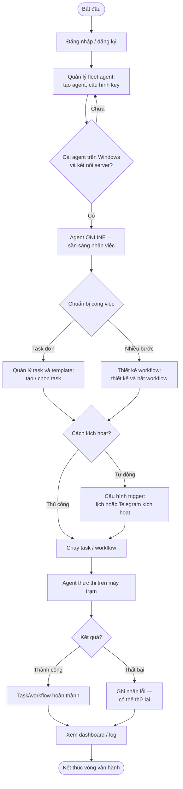

---

## Chương 4 — Phát triển và triển khai ứng dụng

### Hình 4.1 — Biểu đồ gói UML (thiết kế tổng quan, mục 4.1.2)

*Chú thích Word:* Các gói phân theo tầng Presentation → Application → Infrastructure → Data/Execution; mũi tên thể hiện phụ thuộc (liền nét: import/DI; đứt nét: REST/WebSocket).

*Nguồn PlantUML:* `docs/diagrams/hinh-4-1-bieu-do-goi-uml.puml` — export PNG/SVG rồi chèn Word. **Dưới hình** cần chèn **Bảng 4.1** (sự phụ thuộc giữa các gói) từ mục 4.1.2.

*(Nội dung biểu đồ — xem file `.puml` hoặc export từ PlantUML online.)*

---

### Hình 4.1b — Sơ đồ kiến trúc container (tham khảo triển khai)

*Chú thích gợi ý:* Sơ đồ container: trình duyệt (admin SPA), máy chủ NestJS, máy agent Windows, PostgreSQL và Redis. Có thể đặt ở mục 4.5 hoặc phụ lục nếu không dùng trong 4.1.2.

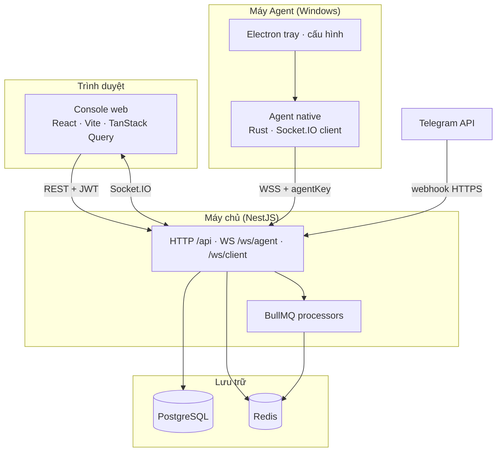

---

### Hình 4.2 — Thiết kế chi tiết gói `server.quan-tri` (mục 4.1.3)

*Nguồn:* `docs/diagrams/hinh-4-2-goi-server-quan-tri.puml` — class diagram, chỉ tên lớp; quan hệ dependency, association, aggregation, inheritance.

---

### Hình 4.3 — Thiết kế chi tiết gói `server.dieu-phoi` (mục 4.1.3)

*Nguồn:* `docs/diagrams/hinh-4-3-goi-server-dieu-phoi.puml`

---

### Hình 4.4 — Thiết kế chi tiết gói `agent.core` (mục 4.1.3)

*Nguồn:* `docs/diagrams/hinh-4-4-goi-agent-core.puml`

---

### Hình 4.5 — Wireframe thiết kế Dashboard *(Mockup 4.2.1)*

Vẽ wireframe: 4 stat card, biểu đồ task, danh sách agent offline. **Không** chụp screenshot sản phẩm.

---

### Hình 4.6 — Wireframe trình soạn workflow *(Mockup 4.2.1)*

Vẽ wireframe: canvas giữa, palette trái, panel thuộc tính phải, toolbar *Lưu* / *Chạy*.

---

### Hình 4.7 — Wireframe quản lý agent *(Mockup 4.2.1)*

Vẽ wireframe: bảng agent + badge ONLINE/OFFLINE + filter trạng thái.

---

### Hình 4.8 — Biểu đồ trình tự dispatch task

*Use case:* UC004 — Chạy task thủ công. Trình tự POST /api/tasks → BullMQ → WebSocket → agent → task:result → cập nhật DB và UI.

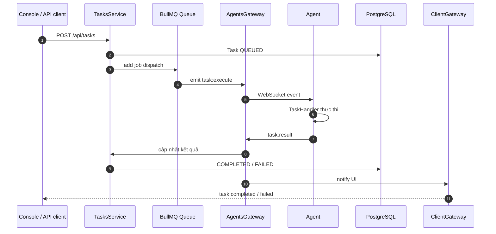

---

### Hình 4.8b — Biểu đồ trình tự chạy workflow

*Use case:* UC005 — Chạy workflow thủ công. Runtime duyệt graph, sinh task con qua TasksService, chờ kết quả từng bước.

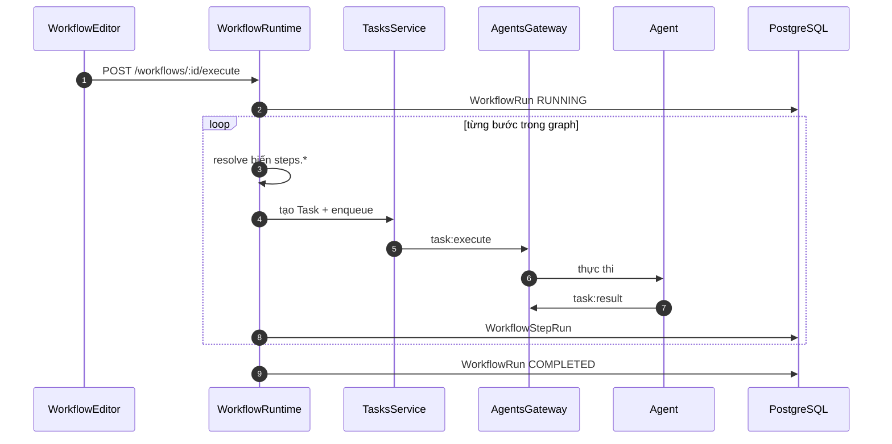

---

### Hình 4.8c — Biểu đồ trình tự trigger Telegram

*Use case:* UC005 (nhánh trigger) — Telegram webhook kích hoạt workflow theo lịch/cấu hình bot.

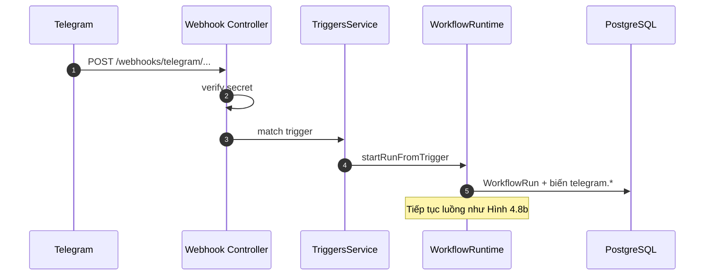

---

### Hình 4.9 — Biểu đồ thực thể–liên kết (E-R)

*Chú thích gợi ý:* Quan hệ User–Agent–Task–Workflow–Trigger và lịch sử thực thi.

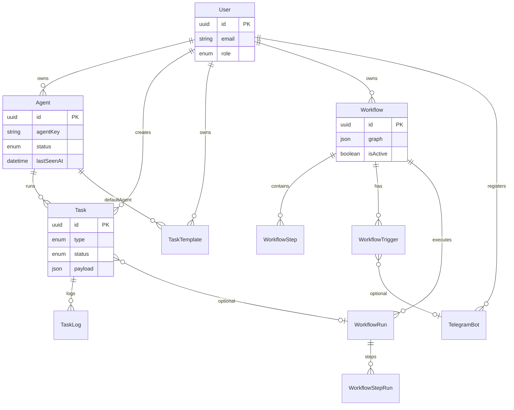

---

### Hình 4.9b — Lược đồ logic nhóm bảng CSDL

*Mức thiết kế:* phân nhóm bảng PostgreSQL theo miền nghiệp vụ và phụ thuộc giữa các nhóm.

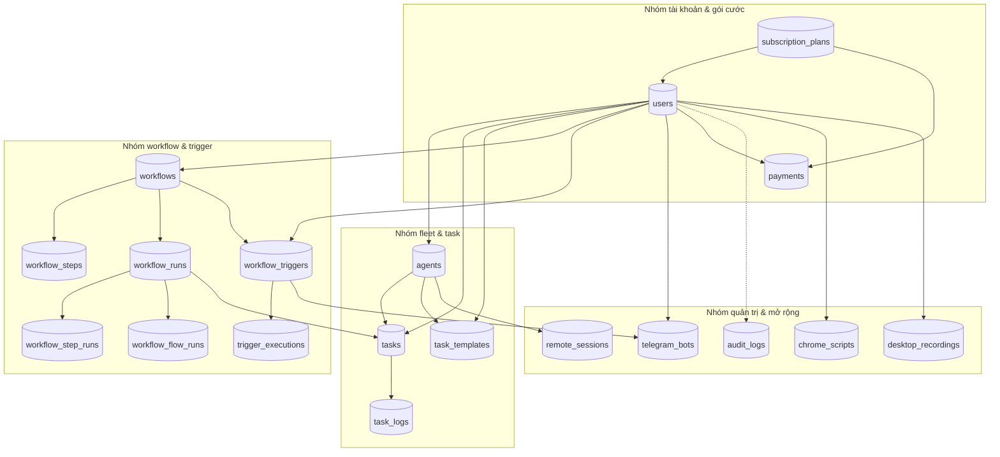

---

### Hình 4.9c — Biểu đồ E-R mở rộng (audit, trigger, billing)

*Mức vật lý:* bổ sung thực thể audit, lịch sử trigger, gói cước và nhánh workflow.

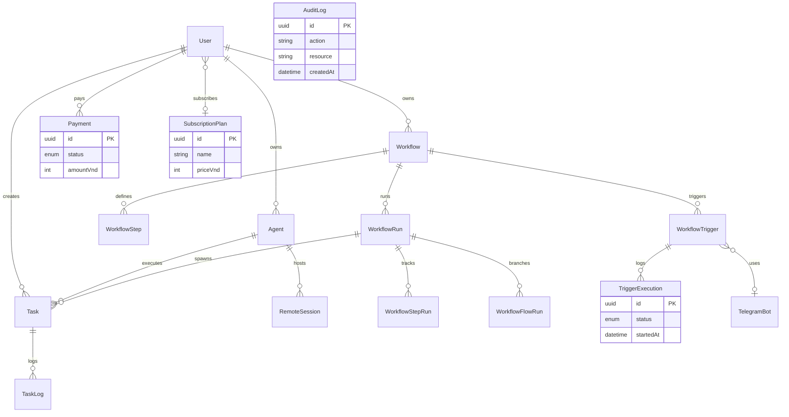

*Ghi chú:* `AuditLog` không FK cứng tới `User` — lưu `actorId`/`actorEmail` dạng mềm.

---

### Hình 4.14 — Schema Prisma / mô hình ORM *(Screenshot)*

Chụp một trong các nguồn sau (chọn rõ ràng nhất):

1. File `prisma/schema.prisma` mở trong VS Code — hiển thị các model `User`, `Agent`, `Task`, `Workflow` và quan hệ `@relation`.
2. Hoặc sơ đồ ERD do extension **Prisma** / lệnh `npx prisma-erd-generator` sinh ra.

*Mục đích:* minh chứng **thiết kế schema trong mã nguồn**, khớp migration PostgreSQL.

---

### Hình 4.15 — Prisma Studio hoặc pgAdmin *(Screenshot)*

Chụp giao diện quản trị CSDL đang chạy (local Docker hoặc Railway PostgreSQL):

- **Prisma Studio:** `npx prisma studio` → chọn bảng `agents`, `tasks`, `workflows` — hiển thị vài dòng dữ liệu mẫu.
- **Hoặc pgAdmin / Railway Data:** danh sách bảng bên trái + preview dữ liệu bên phải.

*Lưu ý:* che email, `agentKey`, `botToken` nếu ảnh đưa vào báo cáo in công khai.

---

### Hình 4.10 — Tạo task và kết quả COMPLETED *(Screenshot)*

Chụp form tạo task (COMMAND/HTTP_REQUEST) + panel kết quả stdout/log khi COMPLETED.

---

### Hình 4.11 — Workflow đang RUNNING *(Screenshot)*

Chụp WorkflowRun đang chạy — trạng thái từng bước trên editor hoặc trang execution.

---

### Hình 4.12 — Sơ đồ triển khai production trên cloud

*Chú thích gợi ý:* Console trên Firebase Hosting; API/WS trên Railway; PostgreSQL và Redis managed; agent Windows kết nối WSS outbound.

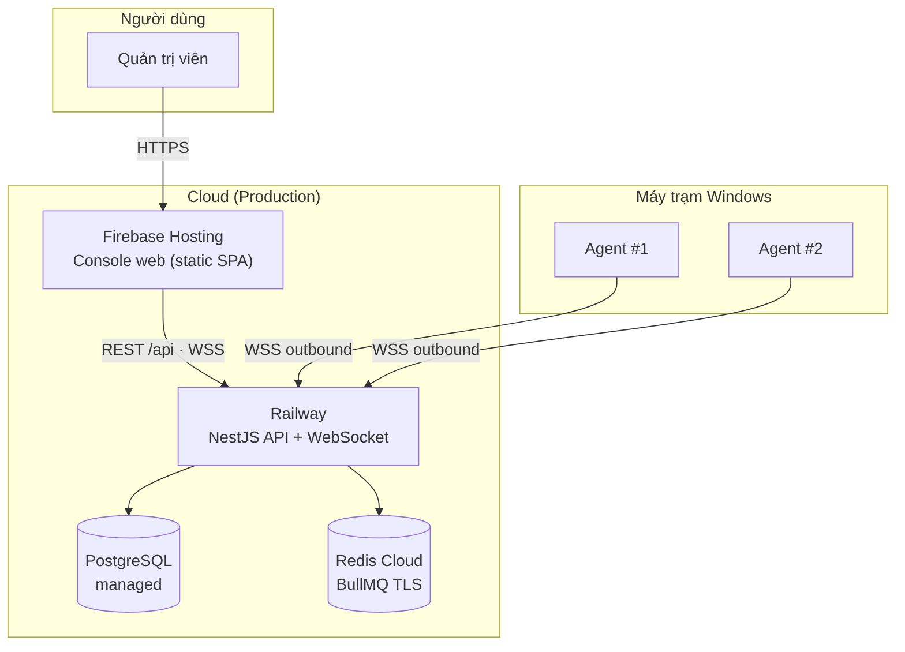

---

### Hình 4.13 — Railway deploy / Health check *(Screenshot, tùy chọn)*

Chụp Railway dashboard (deploy success) hoặc truy cập `GET /api/health` trả 200.

---

## Phụ lục — Biểu đồ bổ sung (Chương 4 / 5)

Có thể đưa vào phụ lục hoặc nhúng trong Chương 5 khi phân tích giải pháp.

### B.1 — Máy trạng thái Task

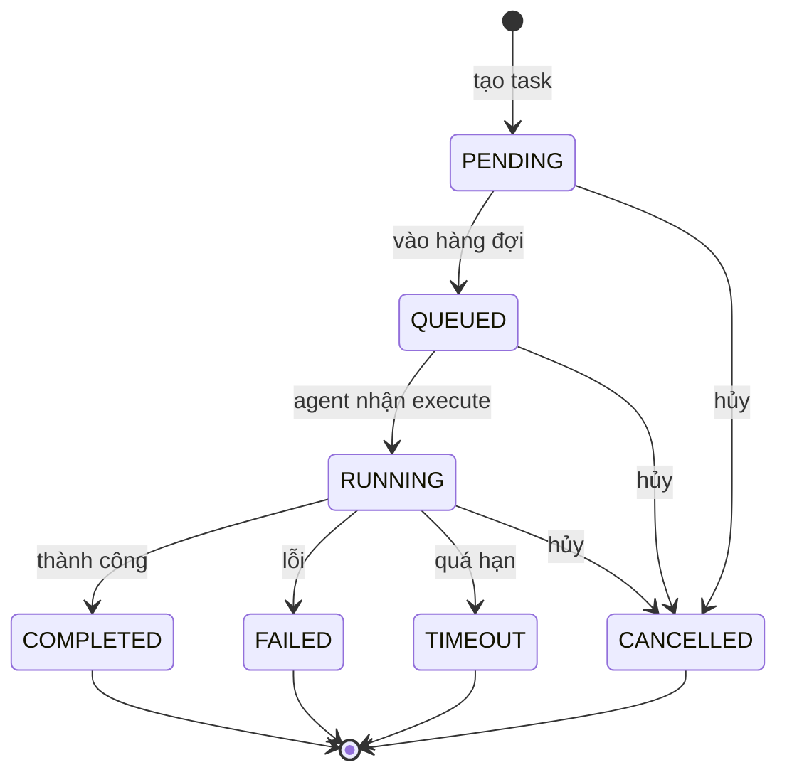

---

### B.2 — Agent kết nối và heartbeat

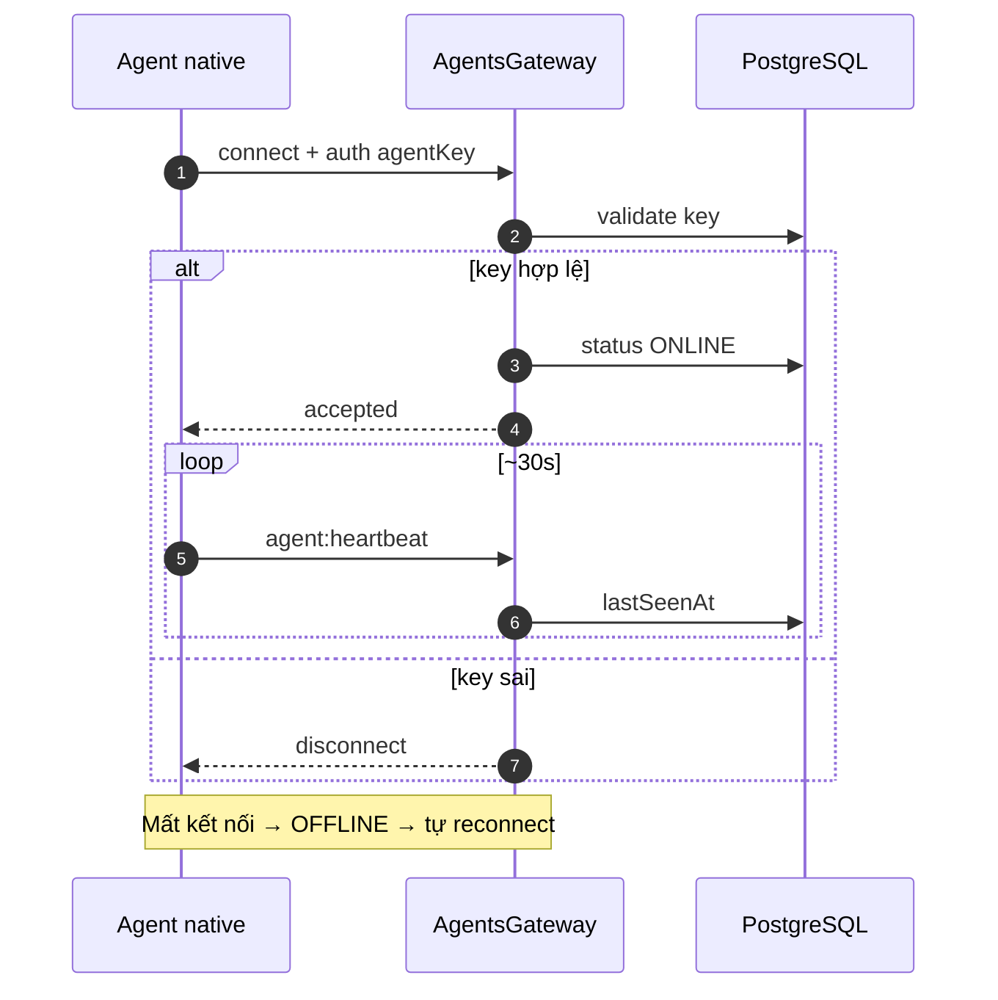

---

### B.3 — Chạy workflow thủ công

---

### B.4 — Trigger Telegram kích hoạt workflow

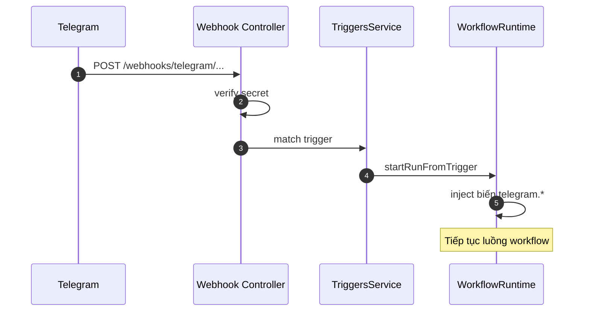

---

### B.5 — Kiến trúc module frontend (Admin SPA) *(tùy chọn)*

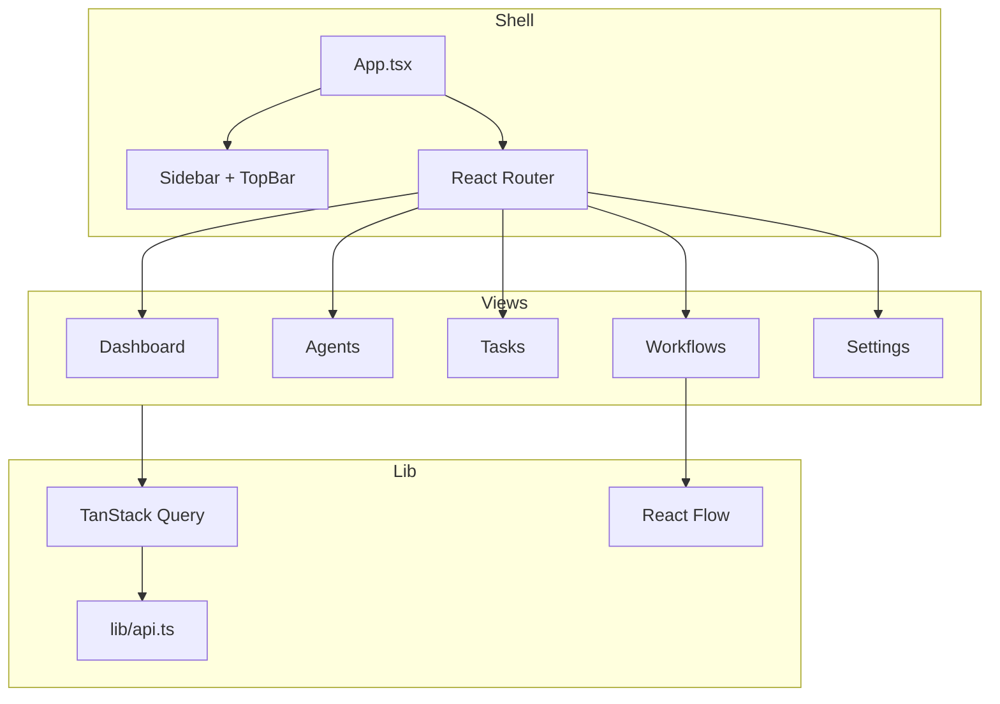

---

## Ghi chú khi chèn Word

- Đặt **Hình** canh giữa, **Chú thích** phía dưới (Times New Roman 13, italic nếu theo quy chế BKHN).
- Screenshot: crop bỏ thông tin nhạy cảm (email, token, agent key).
- Mermaid export khuyến nghị **SVG** (sắc nét khi in) hoặc PNG 2× scale.

*File đồng bộ với `docs/Bao-cao-do-an-noidung.md` — cập nhật tháng 6/2026.*
