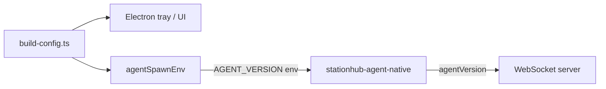

# Hướng dẫn thay đổi version Agent (production)

Tài liệu này mô tả **các file cần sửa** và **quy trình build/đóng gói** khi bump version StationHub Agent (ví dụ `1.0.0` → `1.1.0`).

> Version agent trong repo **không có một nguồn duy nhất**. Phải đồng bộ thủ công các nhóm bên dưới.

---

## Phân loại version

| Loại | Ảnh hưởng | Ví dụ hiển thị |
|------|-----------|----------------|
| **Runtime / UI** | Tray, tab Cài đặt, payload WebSocket `agentVersion` gửi server | `StationHub Agent v1.1.0` |
| **Installer** | Tên file NSIS, metadata `.exe` Electron | `StationHub Agent Setup 1.1.0.exe` |
| **Release bundle** | Tên thư mục/zip khi đóng gói phát hành | `release_v1.1.0/` |
| **Chrome extension** | Manifest MV3 (độc lập agent, thường bump cùng release) | `manifest.json` → `"version"` |

---

## 1. Version runtime (bắt buộc)

Hai file **phải khớp nhau** — đây là version user thấy và server nhận.

| File | Field |
|------|--------|
| `agent/desktop/src/shared/build-config.ts` | `AGENT_VERSION: '…'` |
| `agent/core/src/config/dev_defaults.rs` | `pub const AGENT_VERSION: &str = "…"` |

### Luồng hoạt động



- Tray và tab **Cài đặt** đọc từ `build-config.ts`.
- Khi spawn core, desktop inject `AGENT_VERSION` vào process Rust.
- Core đọc biến môi trường (không đọc từ `agent.env` — key này cố định lúc build).

### Fallback Rust (nên đồng bộ)

| File | Ghi chú |
|------|---------|
| `agent/core/src/config/settings.rs` | `env_str("AGENT_VERSION", "…")` — chỉ dùng khi **không** có env (ví dụ `cargo run` trực tiếp core). Nên đặt cùng version với hai file trên. |

---

## 2. Version installer Electron (bắt buộc khi phát hành bản cài)

| File | Field |
|------|--------|
| `agent/desktop/package.json` | `"version"` |
| `agent/package.json` | `"version"` (metadata monorepo — nên giữ khớp) |

`electron-builder` lấy version từ `desktop/package.json` → tên installer:

```text
StationHub Agent Setup <version>.exe
```

Metadata exe (ProductName, icon, …) được gắn qua `agent/desktop/scripts/after-pack-icon.js`.

---

## 3. Chrome extension (tuỳ chọn, khuyến nghị khi release)

| File | Field |
|------|--------|
| `agent/chrome-extension/manifest.json` | `"version"` |

Không ảnh hưởng agent tray, nhưng Chrome Store / Load unpacked cần version manifest tăng khi đổi extension.

---

## 4. Script đóng gói release

| File | Tham số / chỗ cần để ý |
|------|-------------------------|
| `agent/scripts/pack-release.ps1` | `-Version "…"`, `-OutDir "…\release_v…"` |

Script copy:

- `StationHub-Agent-Setup-<version>.exe`
- `stationhub-desktop-recorder-<version>.exe`
- `StationHub-Chrome-Recorder-<version>.zip`

Script tìm installer trong (theo thứ tự):

1. `agent/desktop/release-v1.0.0/`
2. `agent/desktop/release-fresh/`
3. `agent/desktop/release/`

Khi đổi version, hoặc truyền `-Version` khi chạy script, hoặc cập nhật danh sách thư mục / default `$OutDir` trong script cho khớp thư mục build thực tế.

---

## 5. Không cần sửa (version crate Rust nội bộ)

Các `version = "0.1.0"` trong:

- `agent/core/Cargo.toml`
- `agent/chrome-bridge/Cargo.toml`
- `agent/desktop-recorder/Cargo.toml`

Là version **crate/package Rust**, không phải version agent hiển thị cho người dùng. Chỉ đổi nếu muốn đồng bộ metadata crate (không bắt buộc cho release).

---

## Checklist bump version (ví dụ `1.0.0` → `1.1.0`)

### Bước 1 — Sửa file

- [ ] `agent/desktop/src/shared/build-config.ts` → `AGENT_VERSION`
- [ ] `agent/core/src/config/dev_defaults.rs` → `AGENT_VERSION`
- [ ] `agent/core/src/config/settings.rs` → fallback `env_str("AGENT_VERSION", …)` (khuyến nghị)
- [ ] `agent/desktop/package.json` → `"version"`
- [ ] `agent/package.json` → `"version"`
- [ ] (Tuỳ chọn) `agent/chrome-extension/manifest.json` → `"version"`

### Bước 2 — Build

Chạy từ thư mục `agent/`:

```powershell
# Core Rust (dev_defaults + binary)
npm run build:core

# Desktop Electron (build-config → dist)
npm run build:desktop

# Installer NSIS (output: desktop/release/ hoặc thư mục tùy cấu hình)
npm run dist:desktop
```

Nếu release kèm recorder / chrome bridge:

```powershell
npm run build:desktop-recorder
npm run build:chrome-bridge
```

### Bước 3 — Đóng gói release

```powershell
powershell -NoProfile -ExecutionPolicy Bypass -File scripts/pack-release.ps1 `
  -Version "1.1.0" `
  -OutDir "C:\Users\<user>\Documents\StationHub\release_v1.1.0"
```

### Bước 4 — Kiểm tra trước khi phát hành

| Kiểm tra | Cách |
|----------|------|
| Version tray | Chuột phải icon tray → dòng `StationHub Agent v…` |
| Version UI | Mở Cài đặt → chip `v…` góc trên |
| Version server | Console admin / log WS — field `agentVersion` khi agent kết nối |
| Tên installer | File `StationHub Agent Setup 1.1.0.exe` |
| Không dùng bản dev | `npm run dev` **không** tạo installer; production dùng bản `dist:desktop` |

---

## Lưu ý production

- **`%ProgramData%\StationHub\agent.env`** không chứa `AGENT_VERSION` — version cố định trong binary/build, không chỉnh qua env file trên máy user.
- Sau khi cài bản mới, user cần **gỡ/cài lại** hoặc chạy installer mới; chỉ copy `.exe` core không cập nhật version hiển thị trên tray nếu chưa rebuild desktop.
- Thư mục `agent/desktop/release-*` và `docs/` không tự sync version — luôn build lại sau khi sửa số version.

---

## Tham chiếu

| Tài liệu | Nội dung liên quan |
|----------|-------------------|
| [release-notes-v1.0.0.md](./release-notes-v1.0.0.md) | Release notes bản phát hành (copy vào bundle qua `pack-release.ps1`) |
| [agent/docs/huong-dan-cai-dat.md](../../agent/docs/huong-dan-cai-dat.md) | Cài đặt agent cho người dùng cuối |
| [agent/docs/README.md](../../agent/docs/README.md) | Chỉ mục tài liệu agent |
| [docs/README.md](../README.md) | Chỉ mục tài liệu dự án |
