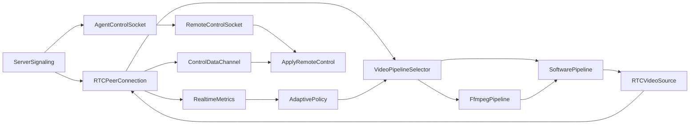

# Realtime Architecture - Agent (VPN-primary)

## Mục tiêu

- Giữ VPN làm đường truyền chính giữa agent và server/client.
- Tối ưu pipeline video + control ở agent để giảm latency và ổn định dưới mạng dao động.
- Bật/tắt được từng thành phần qua feature flag để rollout an toàn.

## Kiến trúc module mới (agent/src/remote)

- `remote-peer.ts`: owner của RTCPeerConnection, capture loop, DataChannel control, getStats.
- `remote-host.ts`: router control message, chọn DataChannel hoặc socket fallback.
- `realtime-metrics.ts`: collector cho capture/convert time, frames sent/dropped, network stats.
- `frame-buffers.ts`: pool reuse RGBA/I420 theo resolution, chỉ realloc khi đổi kích thước.
- `adaptive-policy.ts`: controller FPS với hysteresis + cooldown.
- `input-controller.ts`: giữ nguyên handler control + cache screen dimensions (TTL).
- `video-pipeline.ts`: contract chung cho software/ffmpeg pipeline.
- `software-video-pipeline.ts`: pipeline gửi frame qua `RTCVideoSource` (fallback mặc định).
- `ffmpeg-video-pipeline.ts`: quản lý phiên FFmpeg hardware encode + fallback software.
- `native-encoder/*`: `ffmpeg-probe`, `ffmpeg-session`, `ffmpeg-profiles`, `sdp-bridge`.

## Data flow

## NDC direct media path

`REMOTE_MEDIA_ENGINE=ndc` bật đường truyền H264 direct bằng `node-datachannel`:

- Agent tạo `PeerConnection` libdatachannel riêng cho media/control.
- FFmpeg xuất Annex-B H264 ra stdout.
- `H264TrackFeeder` tách NALU, packetize RTP qua `H264RtpPacketizer`, và gửi qua track.
- Signaling vẫn dùng socket event hiện tại (`remote:offer/answer/ice`) để giữ tương thích.
- Nếu nhánh ndc lỗi, agent tự hạ về `wrtc` software path trong cùng phiên.

## Phase 2 additions

- **Quality profiles**: `low-latency`, `balanced`, `high-quality` đồng nhất từ admin -> backend -> agent.
- **Region-aware TURN**: backend ưu tiên TURN pool theo `preferredRegion`, fallback bằng RTT hints runtime.
- **Telemetry E2E**: agent emit `remote:telemetry`, backend relay room session, admin render panel realtime.
- **Dirty tile diff**: software pipeline tính tile dirty ratio; frame không đổi sẽ skip để giảm bandwidth/cpu.

## Tile patch binary overlay (DataChannel `tilepatch`)

- **Mục tiêu**: video track (I420 → encode) vẫn là nền; các tile thay đổi được gói **RGBA raw** (header + records) và gửi qua DataChannel riêng label `tilepatch` để admin vẽ lên `<canvas>` đè lên `<video>`, giảm cảm giác trễ vùng cục bộ.
- **Agent**: `packTilePatchMessage` (`agent/src/remote/tile-patch/patch-packer.ts`), emit sau khi đã có `dirty rects` + buffer RGBA; `remote-peer` tạo `createDataChannel('tilepatch')` trước `setLocalDescription` (phía answer). **Chỉ** kết hợp `REMOTE_MEDIA_ENGINE=wrtc` + `REMOTE_VIDEO_PIPELINE=software` (ffmpeg/ndc không có RGBA patch JS).
- **Guard**: `REMOTE_TILE_PATCH_MAX_TILES` (quá nhiều tile → bỏ cả frame patch), `REMOTE_TILE_PATCH_MAX_BYTES_PER_SEC` (rolling 1s), telemetry `patchBytes` / `patchDropCount`.
- **Admin**: `pc.ondatachannel` nhận `tilepatch`, `decodeTilePatchMessage`, `putImageData` theo tile trong `requestAnimationFrame`, bỏ frame cũ theo `frameId`, tắt overlay khi channel đóng.
- **Client env**: `VITE_REMOTE_TILE_PATCH_ENABLED` (tắt để chỉ xem video).

## Nguyên tắc thiết kế

- Single in-flight frame: nếu capture trước chưa xong, đếm drop và bỏ frame đó, tránh tích lũy lag.
- Buffer reuse: cấp phát RGBA/I420 theo resolution hiện tại, không cấp phát mỗi frame.
- Control ưu tiên DataChannel: giảm hop so với đi qua server socket; socket giữ vai trò fallback.
- Adaptive FPS: chỉ thay đổi khi qua `cooldownMs`; ngưỡng RTT/loss/drop rate có hysteresis để không dao động.
- Telemetry thống nhất: mọi log có `sessionId` để correlate giữa agent, server, client.
- FFmpeg là Windows-first và có downgrade tự động về software khi session FFmpeg không ổn định.

## Feature flags (env)

Các cờ có trong `agent/.env.example`, mặc định bật:

- `REMOTE_DATACHANNEL_ENABLED`
- `REMOTE_ADAPTIVE_ENABLED`
- `REMOTE_TELEMETRY_ENABLED`
- `REMOTE_TELEMETRY_INTERVAL_MS`
- `REMOTE_TARGET_FPS`, `REMOTE_MIN_FPS`, `REMOTE_MAX_FPS`, `REMOTE_FPS_STEP`
- `REMOTE_ADAPTIVE_COOLDOWN_MS`
- `REMOTE_GOOD_RTT_MS`, `REMOTE_BAD_RTT_MS`
- `REMOTE_GOOD_LOSS`, `REMOTE_BAD_LOSS`
- `REMOTE_SCREEN_CACHE_MS`
- `REMOTE_VIDEO_PIPELINE`, `REMOTE_FFMPEG_PATH`
- `REMOTE_H264_PREFERRED_ENCODER`, `REMOTE_H264_KEYINT`, `REMOTE_H264_PRESET`
- `REMOTE_H264_MIN_BITRATE_KBPS`, `REMOTE_H264_MAX_BITRATE_KBPS`, `REMOTE_H264_BITRATE_STEP_KBPS`
- `REMOTE_SCALE_MIN`, `REMOTE_SCALE_MAX`, `REMOTE_SCALE_STEP`
- `REMOTE_TILE_DIFF_ENABLED`, `REMOTE_TILE_SIZE`, `REMOTE_TILE_DIFF_THRESHOLD`
- `REMOTE_TILE_PATCH_ENABLED`, `REMOTE_TILE_PATCH_MAX_TILES`, `REMOTE_TILE_PATCH_MAX_BYTES_PER_SEC`

## KPI cần đo

- Input latency p50/p95 (ms).
- Frame latency p50/p95 (ms).
- Effective FPS trung bình theo telemetry.
- Packet loss, RTT, jitter từ `getStats`.
- CPU agent trong phiên 60 phút.
- Drop rate = frames_dropped / frames_captured.
- FFmpeg restart count.
- Effective bitrate theo telemetry.

## Test matrix mạng (lab)

| Kịch bản | RTT | Loss | FPS target kỳ vọng |
|----------|-----|------|---------------------|
| LAN sạch | 5-10ms | 0% | >= MAX hoặc gần MAX |
| VPN tốt | 20-40ms | <0.5% | TARGET hoặc cao hơn |
| VPN trung bình | 80-120ms | 1-2% | TARGET, có dao động nhỏ |
| VPN xấu | 150-250ms | 3-5% | Tiệm cận MIN, ổn định |
| Mạng chập chờn | jitter 50ms | 5%+ | MIN, không oscillate |

## Test plan

- Baseline (tắt adaptive + tắt DataChannel + software pipeline): đo KPI.
- Bật lần lượt từng flag: backpressure -> buffer reuse -> telemetry -> adaptive -> DataChannel.
- Bật `REMOTE_VIDEO_PIPELINE=ffmpeg` và đo cùng kịch bản để so sánh trước/sau.
- Soak test 60 phút: kiểm tra memory/CPU drift, không tăng tuyến tính.
- Failover test: ngắt VPN 5-30s, xác nhận session tự recover.
- A/B so sánh với baseline cùng kịch bản thao tác (click, drag, typing, scroll, desktop tĩnh).

## Rollout strategy

1. Deploy bản có feature flag, mặc định bật nhưng để sẵn cách tắt nhanh qua env.
2. Rollout theo nhóm: nhóm dev/test -> nhóm staging -> production hẹp -> production đại trà.
3. Theo dõi log `remote telemetry` và `adaptive fps change` trong 24-72h trước khi mở rộng.
4. Nếu DataChannel gặp sự cố ở client nào đó, tắt flag `REMOTE_DATACHANNEL_ENABLED` => quay về socket control mà không cần redeploy.
5. Chuẩn bị kịch bản rollback: downgrade agent về bản cũ hoặc tắt toàn bộ flag (`REMOTE_ADAPTIVE_ENABLED=false` + `REMOTE_DATACHANNEL_ENABLED=false`) để vận hành giống hành vi cũ.
6. Nếu FFmpeg không ổn định, rollback nóng bằng `REMOTE_VIDEO_PIPELINE=software` (không cần redeploy).

## Việc phía client/admin (ngoài phạm vi agent)

- Admin UI hoặc client cần tạo DataChannel label `control` ở phía offer để agent attach được.
- Agent tạo thêm DataChannel `tilepatch` (binary) phía answer; admin cần `ondatachannel` để nhận overlay (có thể tắt bằng `VITE_REMOTE_TILE_PATCH_ENABLED=false`).
- Nếu client chưa hỗ trợ DataChannel, agent tự động dùng socket control (không cần thay đổi).
- Khi client đã sẵn sàng, có thể mở rộng telemetry 2 chiều qua DataChannel.

## Ghi chú rủi ro

- `@roamhq/wrtc` bản dùng cho Node có thể không đầy đủ stats như browser; một số field RTT/loss có thể không xuất hiện trên mọi phiên. Adaptive policy đã có guard để không đổi khi thiếu dữ liệu.
- Tile diff + tile patch RAW tốn CPU/băng thông nếu màn hình thay đổi toàn cục; dùng `REMOTE_TILE_PATCH_MAX_*` và giữ `REMOTE_TILE_DIFF_THRESHOLD` hợp lý.
- Muốn giảm thêm CPU: cân nhắc thay thư viện capture bằng native có hỗ trợ region (ví dụ `node-screenshots` hoặc platform-specific) - ngoài phạm vi rollout này.
- Trong phase hiện tại, FFmpeg session được dùng để hardware encode capability và giám sát ổn định; đường gửi vào `wrtc` vẫn dựa trên `RTCVideoSource`. Cầu nối encoded RTP trực tiếp nằm ở bước tiếp theo của `sdp-bridge`.
- Khi bật `REMOTE_MEDIA_ENGINE=ndc`, cầu nối RTP/H264 direct được kích hoạt qua `node-datachannel`; `wrtc` trở thành fallback path.
