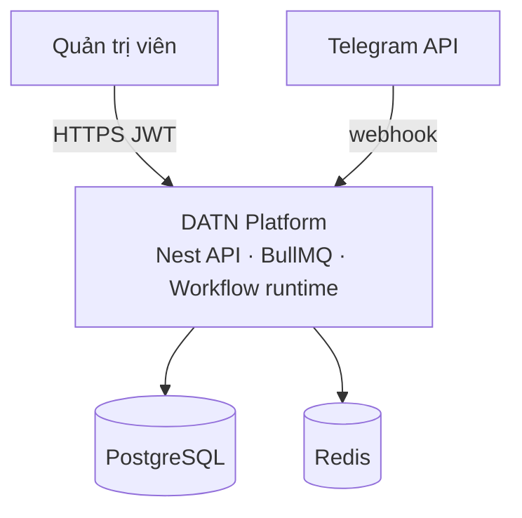
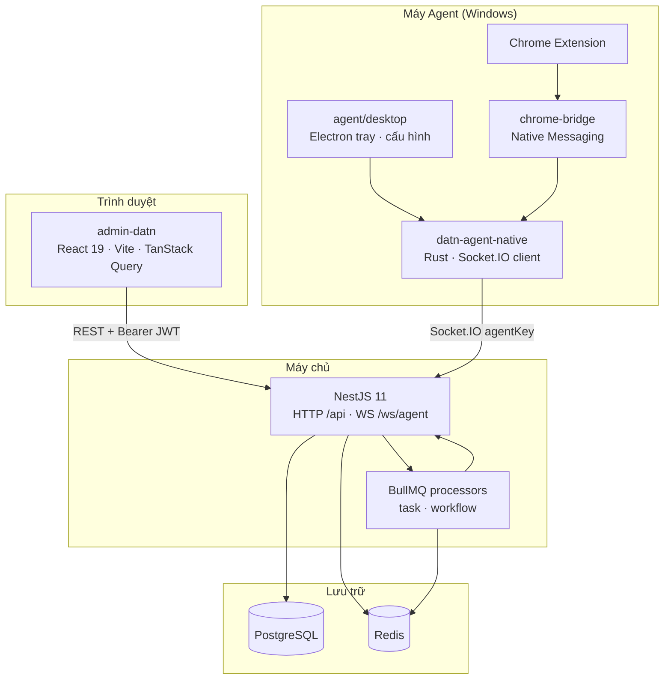
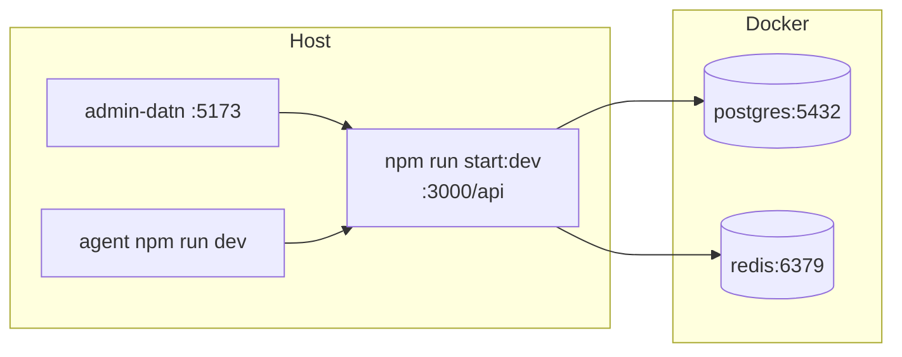
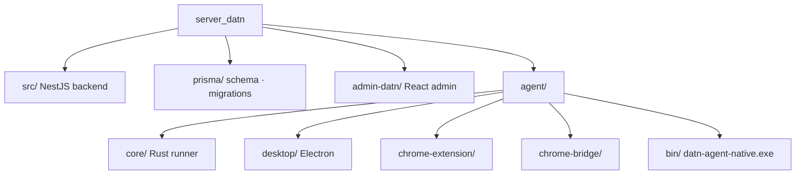
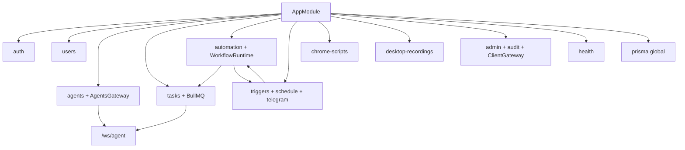
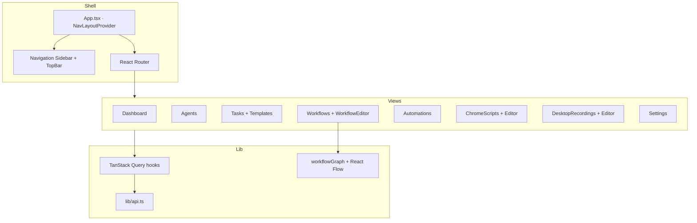
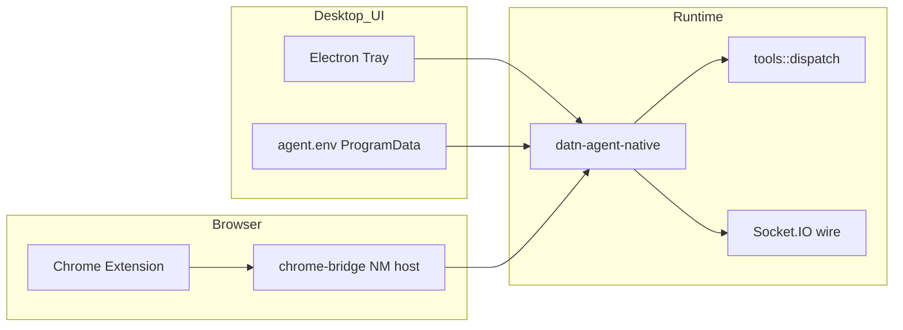
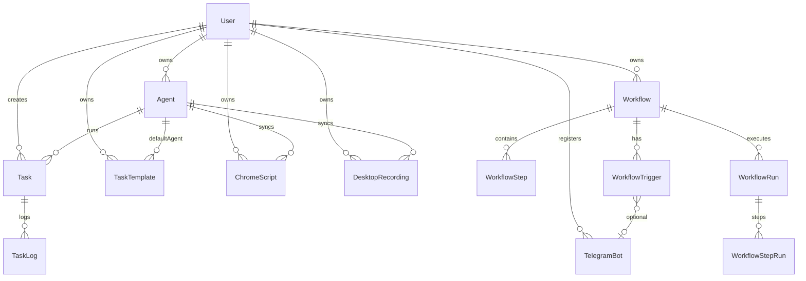
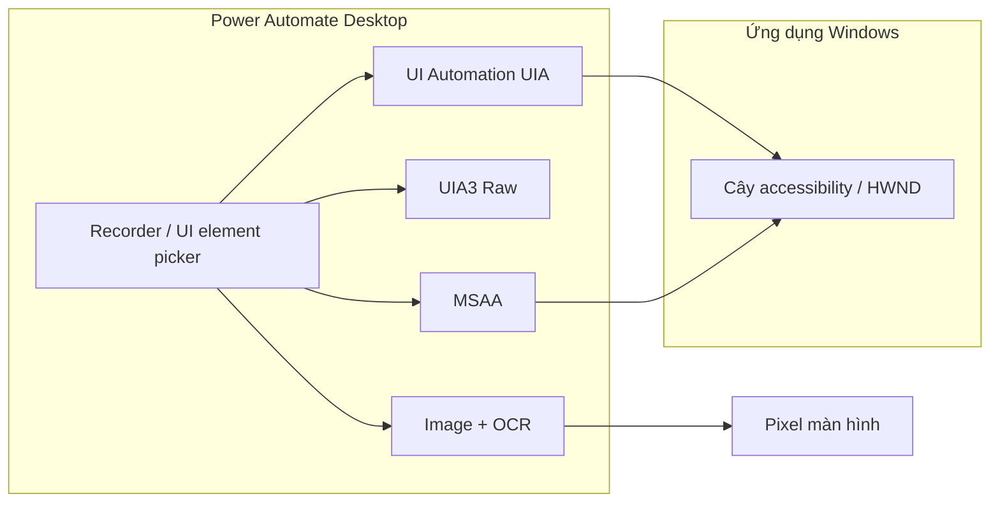

# Kiến trúc tổng thể — server_datn

## Mục tiêu hệ thống

Nền tảng **server + agent + admin**: quản trị user/agent, giao việc (task) tới máy chạy agent, automation/workflow, health; realtime qua **Socket.IO** (`/ws/agent`).

---

## 1. Sơ đồ ngữ cảnh (Context)

> Dùng `flowchart` để tương thích mọi renderer Mermaid (một số công cụ không hỗ trợ `C4Context`).



---

## 2. Sơ đồ container (Container)



---

## 3. Triển khai logic (Deployment — dev)



| Thành phần | URL / cổng mặc định |
|------------|---------------------|
| API + Swagger | `http://localhost:3000/api`, `/api/docs` |
| Admin SPA | `http://localhost:5173` |
| PostgreSQL | `localhost:5432` |
| Redis | `localhost:6379` |
| WebSocket agent | cùng origin API, namespace `/ws/agent` |

---

## 4. Monorepo — cấu trúc package



| Thư mục | Vai trò |
|--------|---------|
| **Root** (`src/`, `prisma/`) | API **NestJS 11**, WebSocket, queue, Prisma |
| **admin-datn/** | SPA **React 19 + Vite + Tailwind**: đăng nhập, quản lý, task, workflow |
| **agent/core/** | Crate **Rust**: Socket.IO `/ws/agent`, heartbeat, task dispatch |
| **agent/desktop/** | Electron: config ProgramData, tray, service |
| **agent/chrome-extension/** | Ghi script, thao tác DOM |
| **agent/chrome-bridge/** | Native Messaging host (Rust) |
| **agent/bin/** | Binary `datn-agent-native.exe` (artifact) |

---

## 5. Kiến trúc module NestJS



| Module | Trách nhiệm |
|--------|-------------|
| **auth** | Login, refresh token, JWT |
| **users** | CRUD user, RBAC (`ADMIN` / `USER`) |
| **agents** | CRUD agent, `agentKey`, **AgentsGateway** |
| **tasks** | Task CRUD, **task templates** (`/api/tasks/templates`), BullMQ, dispatch `task:execute` |
| **automation** | Workflow CRUD, graph, **WorkflowRuntimeService** |
| **triggers** | CRUD trigger (`/api/triggers`), schedule, Telegram webhook, kích hoạt workflow |
| **chrome-scripts** | CRUD + `POST /api/chrome-scripts/sync` (qua WS agent) |
| **desktop-recordings** | CRUD + `POST /api/desktop-recordings/sync` |
| **admin** | Dashboard, audit, task template admin routes, **ClientGateway** `/ws/client` |
| **health** | `/api/health` |

Chung: **`src/common`** (guards, filters, `WS_EVENTS`, `ws-protocol`), **`src/config`**.

**WebSocket namespaces:** `/ws/agent` (agent), `/ws/client` (admin UI — `task:completed`, …).

---

## 6. Kiến trúc Admin SPA



| Route chính | View |
|-------------|------|
| `/` | Dashboard |
| `/agents` | Agents |
| `/tasks` | Tasks, templates |
| `/workflows` | Workflow list + editor (React Flow) |
| `/automations` | Triggers (read-only) |
| `/chrome-scripts` | Script list + flow editor |
| `/desktop-recordings` | Recording list + flow editor |
| `/settings` | User management (admin) |

---

## 7. Kiến trúc Agent



---

## 8. Mô hình dữ liệu (tóm tắt)



`WorkflowStep.type`: `COMMAND` | `SCRIPT` | `DELAY` | `CONDITION` | `TELEGRAM` (không có literal `TASK`).

Chi tiết field: `prisma/schema.prisma`.

---

## Stack kỹ thuật

| Tầng | Công nghệ |
|------|-----------|
| Backend | NestJS 11, Pino, JWT, Throttler, BullMQ, `@nestjs/schedule` |
| DB | PostgreSQL 16, Prisma |
| Queue / cache | Redis 7, BullMQ |
| Realtime | Socket.IO `/ws/agent` |
| Admin | React 19, Vite, Tailwind, TanStack Query, React Flow (`@xyflow`) |
| Agent | Rust, Electron, Chrome Extension MV3 |

---

## Hạ tầng local

- **`docker-compose.yml`**: PostgreSQL, Redis.
- API prefix: **`/api`** (`src/main.ts`); Swagger **`/api/docs`**.

---

## Khởi động nhanh (dev)

**Backend** (repo root):

```bash
npm install
cp .env.example .env
npm run docker:up
npm run prisma:migrate
npm run prisma:seed
npm run start:dev
```

**Admin UI** (`admin-datn/`):

```bash
cd admin-datn
npm install
npm run dev
```

**Agent** (`agent/`):

```bash
npm install
cp .env.example .env
npm run build:core
npm run dev
```

---

## Logging

- **Server**: `nestjs-pino` (`src/app.module.ts`).
- **Agent**: stdout/stderr `datn-agent-native`, Electron Pino.

---

## 9. Bắt Windows & control — Power Automate Desktop (PAD) vs DATN

**Power Automate Desktop** (Microsoft) không “đọc pixel” làm mặc định khi ghi/thao tác UI desktop. Nó dựa trên **accessibility tree** của Windows và (tùy chọn) **nhận dạng ảnh/OCR**.

### PAD — công nghệ chính

| Lớp | Công nghệ | Dùng khi |
|-----|-----------|----------|
| **UI Automation (UIA)** | API `IUIAutomation` — mặc định picker & recorder | WPF, WinForms, UWP, hầu hết app desktop hiện đại; selector theo `ControlType`, `Name`, `AutomationId`, hierarchy |
| **UIA3 Raw** | Raw view cây UIA | Cần lộ toàn bộ lớp trung gian trong cây automation |
| **MSAA** | Microsoft Active Accessibility (legacy) | VB6, Win32 cũ, app không expose UIA |
| **Image recording** | So khớp ảnh vùng màn hình + **OCR** | App không có cây control ổn định; chờ/chọn theo hình |
| **OCR** (action riêng) | **Windows OCR** hoặc **Tesseract** | Trích chữ từ màn hình/cửa sổ/file ảnh; “wait for text on screen” |
| **Web trong recorder** | Browser automation (tách khỏi UIA desktop) | Tab trình duyệt — tương tự hướng extension/DOM, không thay UIA cho Chrome nội bộ |

Recorder PAD gắn thao tác chuột/phím với **UI element** (selector UIA/MSAA), không chỉ tọa độ thuần — khác recorder tọa độ đơn thuần.

Tài liệu Microsoft: [Automate using UI elements](https://learn.microsoft.com/en-us/power-automate/desktop-flows/ui-elements), [Record desktop flows](https://learn.microsoft.com/en-us/power-automate/desktop-flows/recording-flow), [OCR actions](https://learn.microsoft.com/en-us/power-automate/desktop-flows/actions-reference/ocr).



### DATN — hiện trạng

| Kênh | Cách “bắt” UI | Ghi chú |
|------|----------------|---------|
| **Chrome script** | Chrome Extension + Native Messaging → DOM (`click`, `fill`, `snapshotDom`) | Gần PAD phần web, không dùng UIA |
| **Desktop recording** | `rdev` + **UIA** (`datn-windows-uia`): click kèm `uia.target`; replay ưu tiên `InvokePattern`, fallback tọa độ | Tùy chọn GUI/CLI `--no-uia`; chưa MSAA/OCR |
| **SCREEN_CAPTURE** | Chụp PNG màn hình | Không sinh selector/control |

### DATN đã có (desktop-recorder)

- Crate **`agent/datn-windows-uia`**: `ElementFromPoint` + snapshot (`controlType`, `name`, `automationId`, `ancestors`).
- Ghi: mỗi **click** có thể có field `uia` trong JSON (`captureUia` / checkbox GUI).
- Chạy lại: `datn-agent-native` / task `DESKTOP_AUTOMATION` — `try_invoke_click` rồi fallback `SetCursorPos` + `SendInput`.

### Hướng tiếp (gần PAD đầy đủ)

1. **MSAA** fallback cho app legacy.
2. **`setValue` / ValuePattern** cho TextBox khi gõ (hiện vẫn `typeText` tọa độ).
3. **OCR / image** khi UIA trống (game, canvas).

---

## Rủi ro / lưu ý vận hành

- Không commit `.env`.
- Debug WS: đối chiếu log Nest **và** log agent cùng thời điểm.
- Admin mở qua **HTTPS** hoặc `localhost` — tránh `crypto.randomUUID` không khả dụng trên HTTP cũ (đã có fallback `randomId`).

---

## Tài liệu liên quan

- [flows.md](./flows.md) — luồng nghiệp vụ có sequence diagram
- [agent.md](./agent.md) — cấu hình & build agent
- [code-reference.md](./code-reference.md) — đường dẫn file
