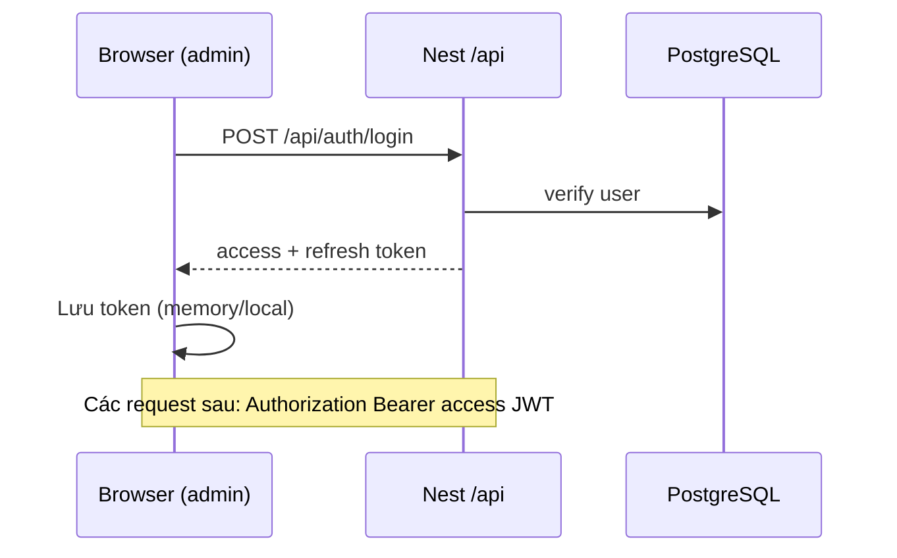
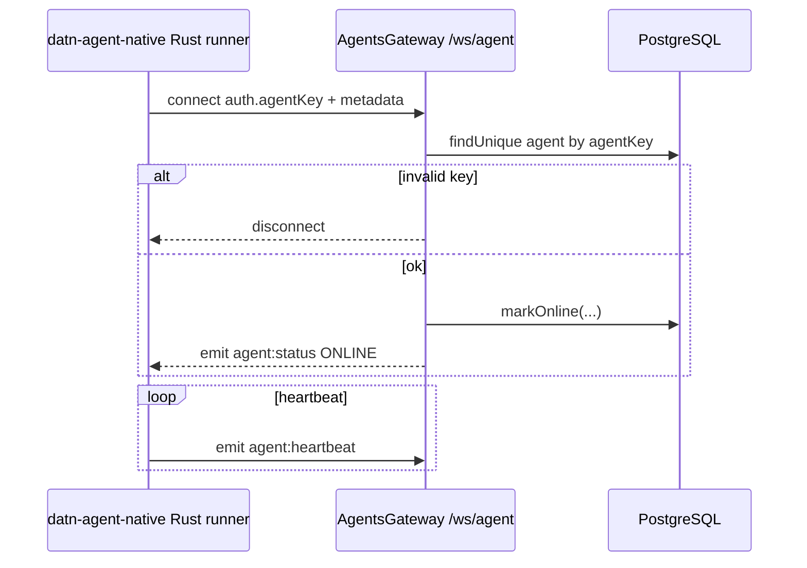
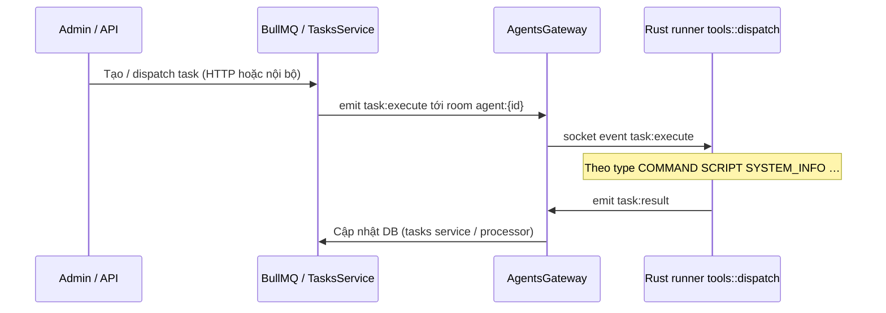

# Luồng hoạt động (sơ đồ)

Các luồng chính giữa **admin**, **API/Nest**, **agent**, **DB/Redis**. Sự kiện socket lấy tên logic từ `src/common/constants/index.ts` và payload từ `src/common/types/ws-protocol.ts`.

---

## 1. Đăng nhập admin → gọi API có JWT



Refresh: client gọi endpoint refresh (theo `auth` module), server cấp access mới.

---

## 2. Agent online (`/ws/agent`)



Khi agent ngắt kết nối: gateway đánh dấu offline (logic trong `agents.gateway` / service).

---

## 3. Task: server → agent → kết quả



Chi tiết dispatch nằm ở module **`tasks`** + gateway **`agents`**.

---

## 4. Phụ thuộc dữ liệu (tổng quan)

```mermaid
flowchart LR
  subgraph Clients
    AD[Admin SPA]
    AG[datn-agent-native]
  end

  subgraph Server
    API[Nest HTTP /api]
    WS1[/ws/agent]
  end

  DB[(Postgres)]
  RD[(Redis)]

  AD --> API
  AG --> WS1
  API --> DB
  WS1 --> DB
  API --> RD
```

---

Ghi chú: tên event thực tế trùng với hằng số string trong code (ví dụ `task:execute`); bảng đầy đủ xem **`code-reference.md`** phần constants.
