# Luồng hoạt động (sơ đồ)

Các luồng chính giữa **admin**, **API/Nest**, **agent**, **DB/Redis**. Tên event socket: `src/common/constants/index.ts`, payload: `src/common/types/ws-protocol.ts`.

> **Xem sơ đồ:** GitHub/GitLab preview, VS Code extension *Mermaid*, hoặc trang `/docs` trong admin.

---

## Mục lục luồng

| # | Luồng | Loại sơ đồ |
|---|--------|------------|
| 1 | [Đăng nhập admin](#1-đăng-nhập-admin--jwt) | Sequence |
| 2 | [Agent online](#2-agent-online-wsagent) | Sequence |
| 3 | [Task dispatch](#3-task-server--agent--kết-quả) | Sequence |
| 4 | [Trạng thái task](#4-trạng-thái-task) | State |
| 5 | [Chạy workflow thủ công](#5-chạy-workflow-thủ-công) | Sequence |
| 6 | [Trigger lịch](#6-trigger-lịch-schedule) | Flowchart |
| 7 | [Trigger Telegram](#7-trigger-telegram) | Sequence |
| 8 | [Sync Chrome script](#8-đồng-bộ-chrome-script-từ-agent) | Sequence |
| 9 | [Sync desktop recording](#9-đồng-bộ-desktop-recording) | Sequence |
| 10 | [Task template → task](#10-task-template--tạo-task) | Flowchart |
| 11 | [Phụ thuộc tổng quan](#11-phụ-thuộc-dữ-liệu-tổng-quan) | Flowchart |

---

## 1. Đăng nhập admin → JWT

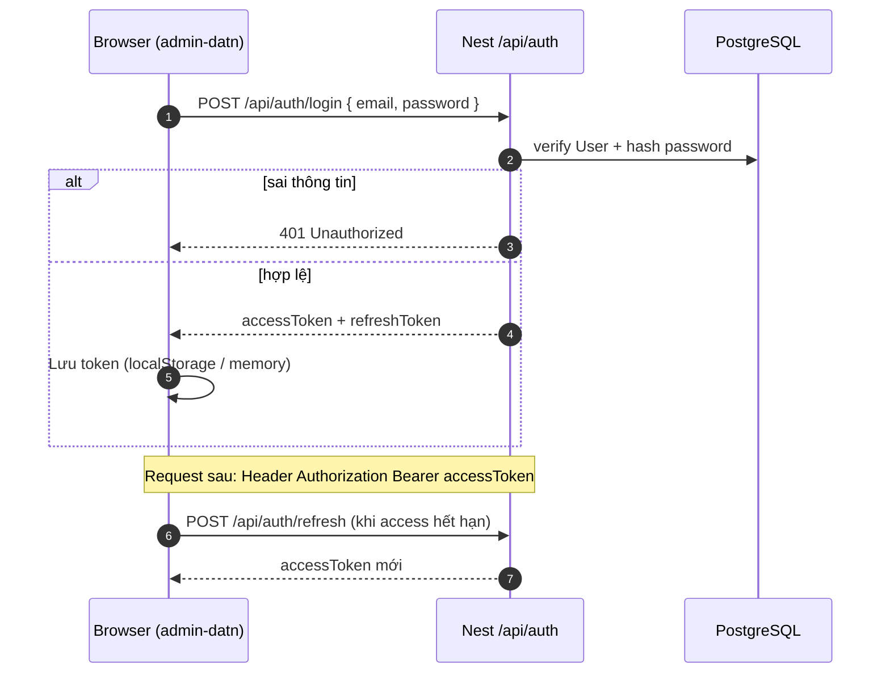

---

## 2. Agent online (`/ws/agent`)

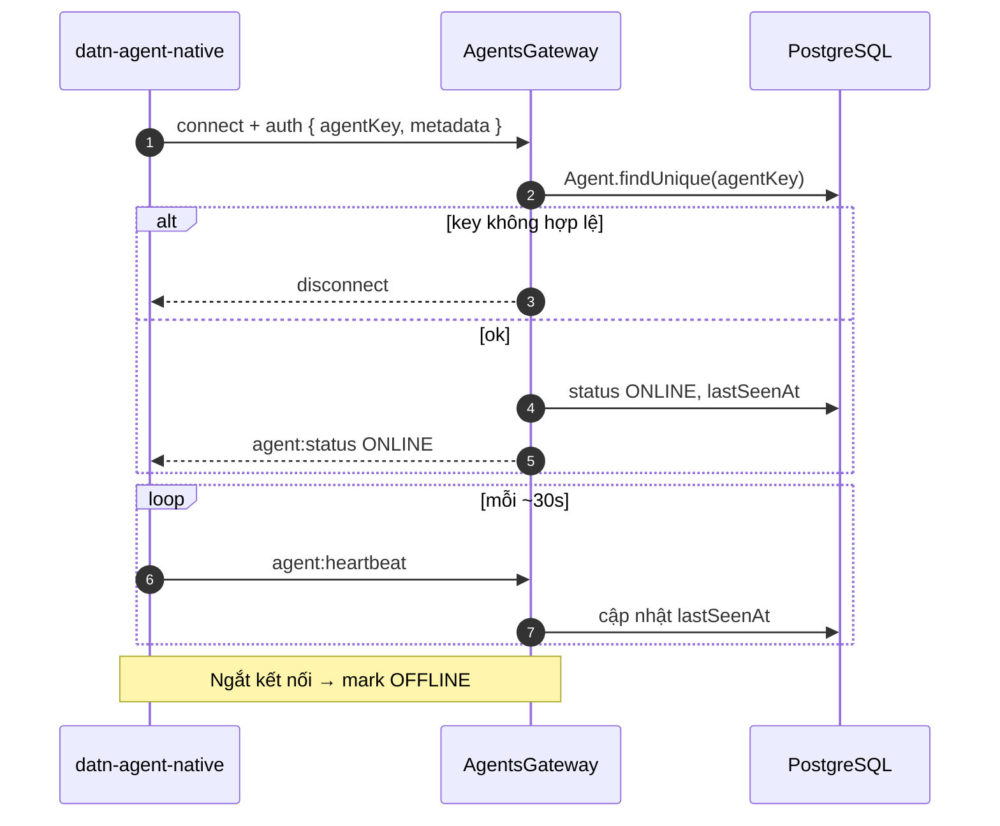

---

## 3. Task: server → agent → kết quả

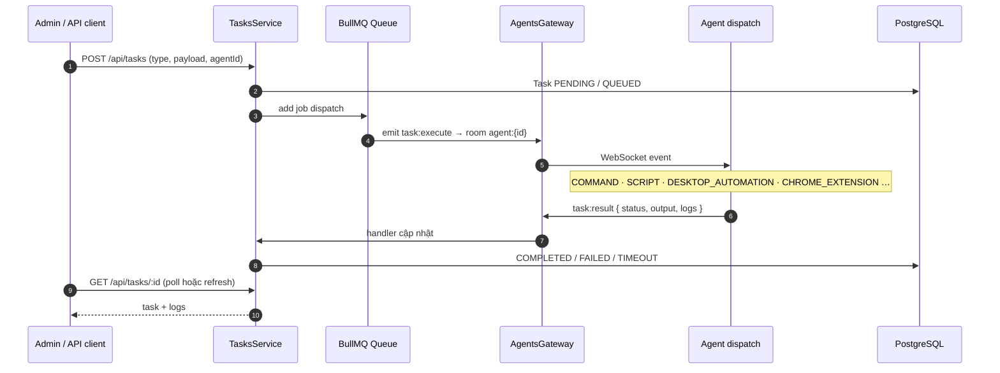

---

## 4. Trạng thái task

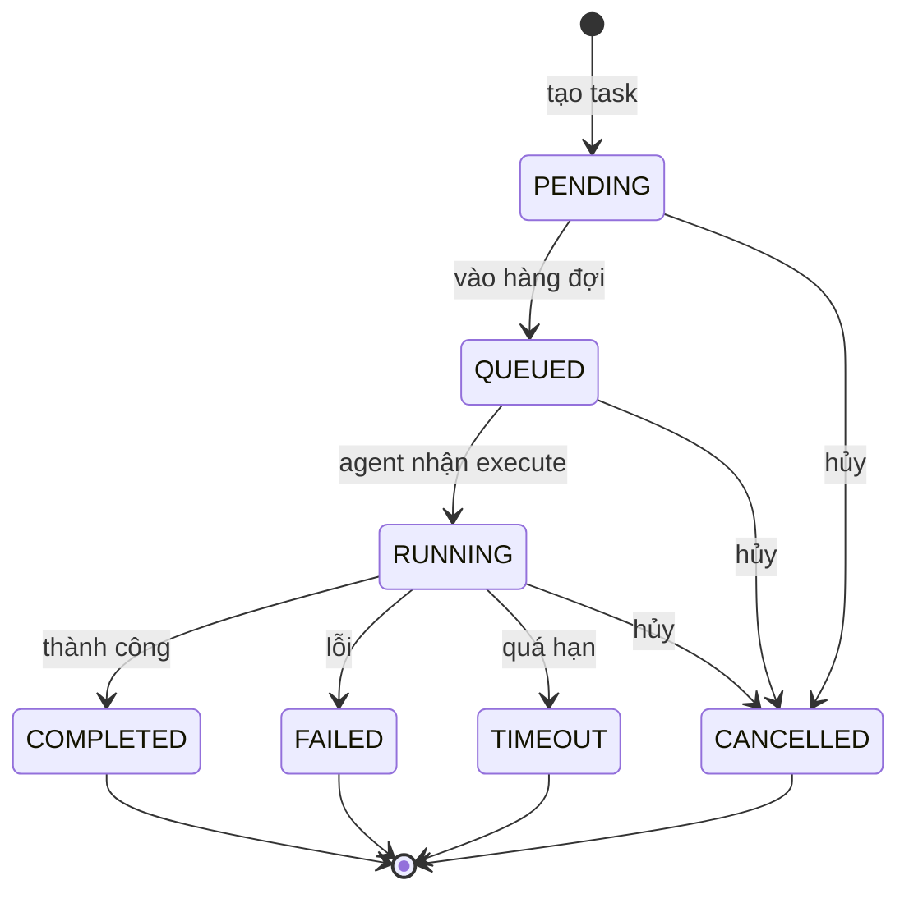

---

## 5. Chạy workflow thủ công

Admin bấm **Chạy** trên `WorkflowEditor` → `POST /api/workflows/:id/execute`.

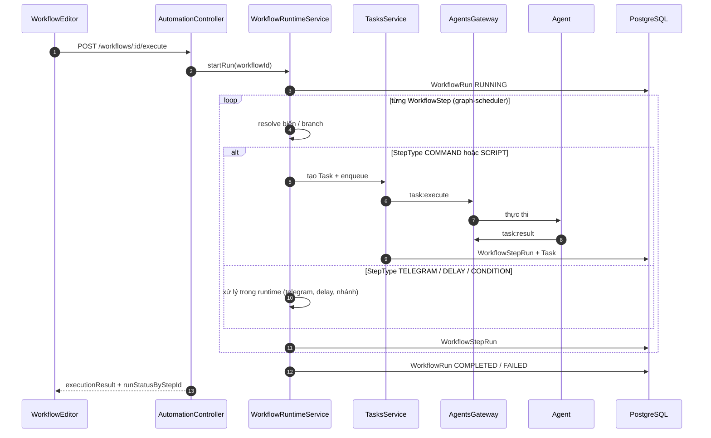

---

## 6. Trigger lịch (SCHEDULE)

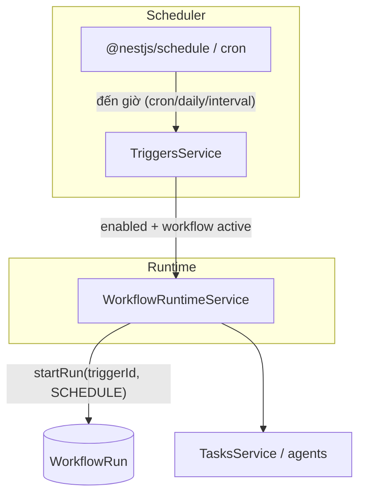

Điều kiện: `WorkflowTrigger.enabled`, `Workflow.isActive`, `scheduleKind` + `cronExpression` / `intervalSeconds` / `dailyHour`.

---

## 7. Trigger Telegram

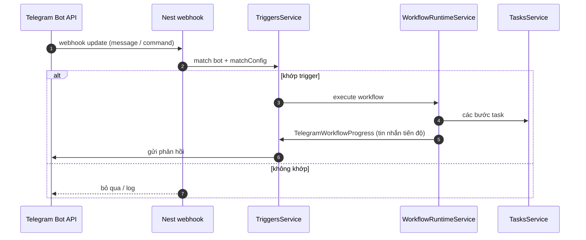

---

## 8. Đồng bộ Chrome script từ agent

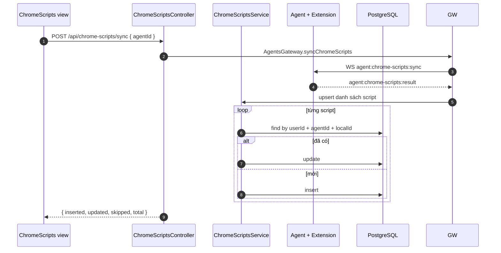

Admin có thể **import** script vào workflow graph (`WfChromeScriptImport`).

---

## 9. Đồng bộ desktop recording

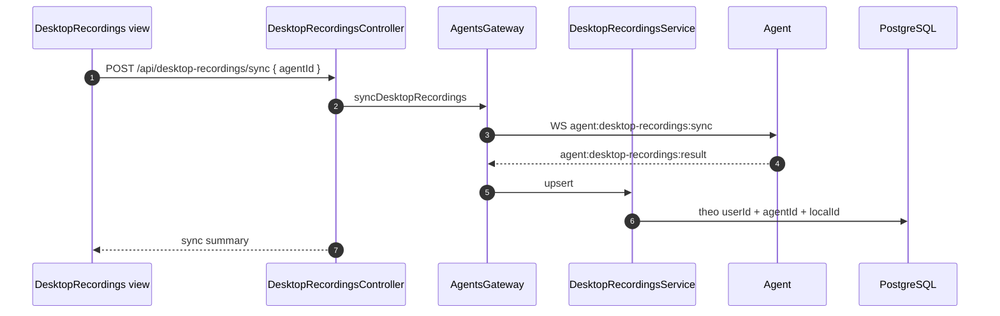

Tương tự chrome: import vào workflow hoặc **tạo task template** từ recording.

---

## 10. Task template → tạo task

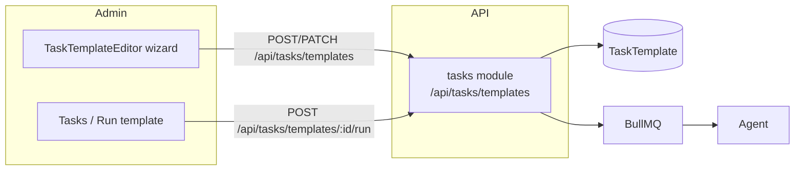

Payload template hỗ trợ: `DESKTOP_AUTOMATION`, `CHROME_EXTENSION`, `SCREEN_CAPTURE`, …

---

## 11. Phụ thuộc dữ liệu (tổng quan)

```mermaid
flowchart TB
  subgraph Clients
    AD[Admin SPA]
    AG[datn-agent-native]
    TG[Telegram]
  end

  subgraph Server
    API[Nest HTTP /api]
    WS[/ws/agent AgentsGateway]
    RT[WorkflowRuntime]
    SCH[Schedule / Triggers]
  end

  DB[(PostgreSQL)]
  RD[(Redis BullMQ)]

  AD --> API
  AG --> WS
  TG --> API
  API --> DB
  WS --> DB
  API --> RD
  SCH --> RT
  RT --> API
  RT --> WS
```

---

## 12. Luồng UI — Workflows (admin)

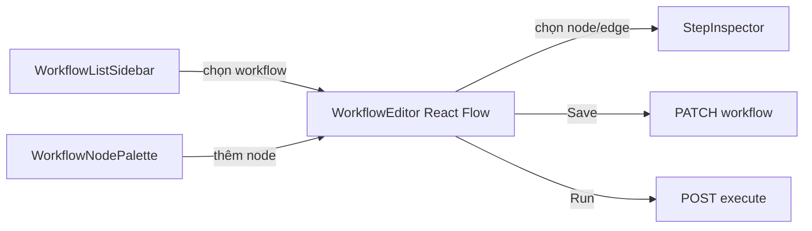

Mobile: list overlay → tap canvas ẩn list; desktop: ẩn list khi focus editor, nút **Mở danh sách workflow** mở lại.

---

## Bảng event WebSocket

### Namespace `/ws/agent` (agent)

| Event | Hướng | Mô tả |
|-------|--------|--------|
| `agent:register` | Agent → Server | Đăng ký metadata lúc connect |
| `agent:heartbeat` | Agent → Server | Giữ online |
| `agent:telemetry` | Agent → Server | CPU/RAM, … |
| `agent:status` | Server → Agent | Trạng thái |
| `task:execute` | Server → Agent | Lệnh thực thi |
| `task:result` | Agent → Server | Kết quả |
| `task:progress` | Agent → Server | Tiến độ (nếu có) |
| `agent:chrome-scripts:sync` / `:result` | ↔ | Đồng bộ script |
| `agent:desktop-recordings:sync` / `:result` | ↔ | Đồng bộ recording |
| `agent:chrome-profiles:sync` / `:result` | ↔ | Đồng bộ profile Chrome |

### Namespace `/ws/client` (admin UI)

| Event | Hướng | Mô tả |
|-------|--------|--------|
| `task:completed` | Server → Browser | Thông báo task xong (UI refresh) |
| `task:failed` | Server → Browser | Task lỗi |

Nguồn: **`src/common/constants/index.ts`** (`WS_EVENTS`), payload: **`src/common/types/ws-protocol.ts`**.

---

## Tài liệu liên quan

- [architecture.md](./architecture.md) — sơ đồ kiến trúc container & module
- [code-reference.md](./code-reference.md) — đường dẫn file implementation
